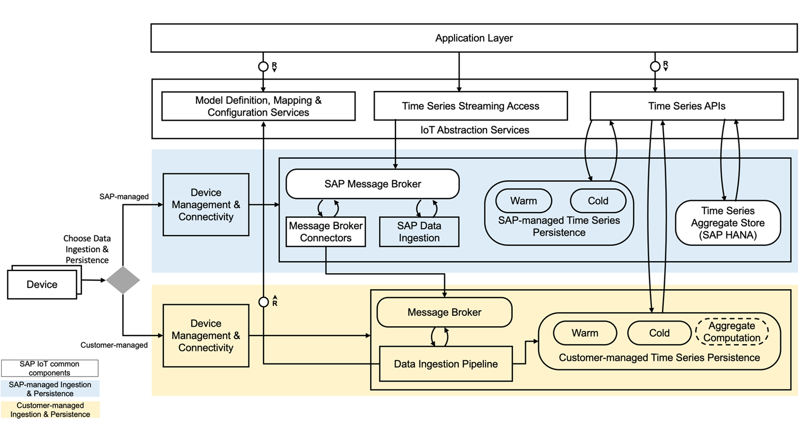

# SAP IoT with Customer-managed Azure Ingestion and Persistence

## Description

This IoT sample application provides a reference for enabling ingestion and persistence of time series data in customer-managed Azure landscape with integration to SAP IoT. The data in persistence and streaming platform shall conform to SAP defined schema. 

SAP IoT Customer-managed Data Persistence and Streaming Abstraction enables SAP Line of Business (LoB) Applications (e.g., Enterprise Product Development) to consume time series data both via REST and streaming from SAP and non-SAP i.e., customer-managed Hyperscaler Data Lake with SAP-defined schema. 

You can refer to the SAP Help Documentation on [Customer-managed Time Series Data Persistence and Streaming](https://help.sap.com/viewer/DRAFT/224d189da0314339a1dd99489de10e48/2008a/en-US/f462b54bdf664a819e1d3af3db4d9dde.html) for additional details

In this sample application, a reference for building customer-managed device management, ingestion and persistence is provided. You can extend or customize this application based on your requirement, with still conforming to the SAP defined schema as outlined in [SAP Defined Schema](https://help.sap.com/viewer/DRAFT/224d189da0314339a1dd99489de10e48/2008a/en-US/e8ecfd58a5974bbb83706cf5d3706485.html) reference 

## Prerequisites

- [SAP Cloud Platform](https://cloudplatform.sap.com/index.html) account with Cloud Foundry enabled
- Subscription to SAP Business Application consuming SAP IoT Services 
  - Currently only supported in SAP Enterprise Product Development application
- [SAP Internet of Things](https://www.sap.com/products/iot-data-services.html) Service instance and service key
- Subscription to [Microsoft Azure](https://azure.microsoft.com/)
- Java 8

## Download and Installation

Click on the `Clone or download` button to download as a zip, or [clone the repository](https://help.github.com/articles/cloning-a-repository/) on your 
desktop.

Follow these steps to create and upload the zip file:

1. Run maven build (install) on this project and locate the zip files from the maven build output for the required modules:  
    1. sap-iot-hyperscaler-azure-integration-ref/ingestion-functions/target folder will contain the ingestion-functions.zip file
    2.  sap-iot-hyperscaler-azure-integration-ref/notification-processor/target folder will contain the notification-processor.zip file
    3. sap-iot-hyperscaler-azure-integration-ref/device-management-functions/target folder will contain the device-management-functions.zip file.
2. [Upload the zip files to a blob storage container](https://docs.microsoft.com/en-us/azure/storage/blobs/storage-quickstart-blobs-portal)
    1. ingestion-functions.zip
    2. notification-processor.zip
    3. device-management-functions.zip
3. [Generate SAS token url as template input parameter](https://docs.microsoft.com/en-us/azure/storage/common/storage-sas-overview)
    > Note: The expiry of the SAS token will lead to inactivity of the function. You should therefore ensure to pick an appropriate expiration date.

Details for building and deploying the Azure Resource Manager template for creating Device Management, Ingestion and Persistence components are explained in this [ARM](doc/ARM.md) documentation

## Limitations

- Cloud to Device Command flow is not supported
- Delete of time series  data is not supported

## Documentation

We provided the complete documentation inside [docs](./doc) folder.

- [Deploy Ingestion and Persistence components using Azure Resource Manager Template](doc/ARM.md)
- [Ingestion and Mapping Function](doc/Ingestion.md) 
- [Ingest Measures from SAP IoT Measurements Write API](doc/AvroParserFunction.md)
- [Delete Time Series](doc/DeleteTimeSeries.md) 
- [Event Hub Configuration and Message details](doc/MessageBroker.md)
- [Device Lifecycle Management](doc/DeviceManagement.md) 
- [Notification Processing](doc/NotificationProcessor.md)
- [Error Handling & Alerting](doc/ErrorHandling.md) 
- [Security](doc/Security.md) 

## Support

The content is provided "as-is". There is no guarantee that raised issues will be answered or addressed in future releases.

## License

Copyright (c) 2020 SAP SE or an SAP affiliate company. All rights reserved. This file is licensed under the Apache Software License, version 2.0  except as 
noted otherwise in the REUSE files.

