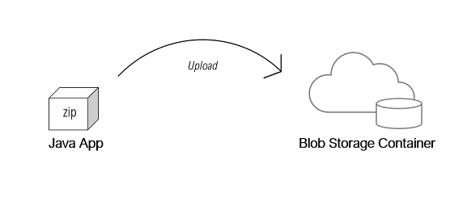
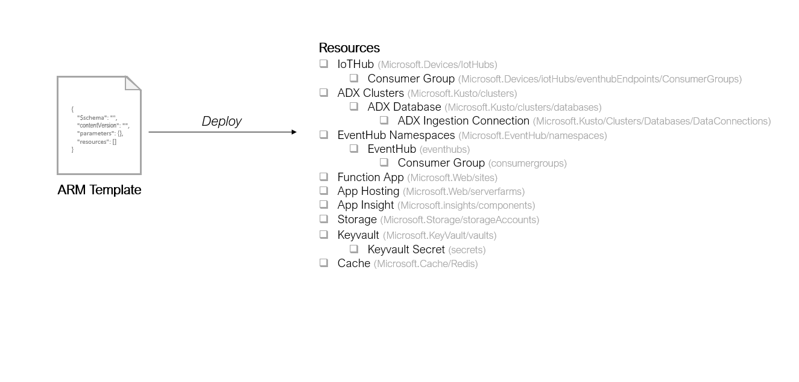
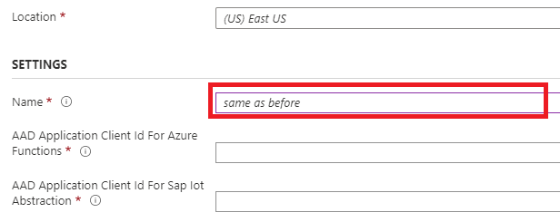

# Deploy Azure Resource Manager Template

## Overview
Azure Resource Managed (ARM) template enables infrastructure as code, and allows defining the required resources and configuration (target state) in a declarative syntax. You can refer to more details on Azure Resource template and its usage in [Microsoft Azure documentation](https://docs.microsoft.com/en-us/azure/azure-resource-manager/templates/).

The ARM template provided in this sample implementation sets up all the resources and configuration as required for creating ingestion & persistence for IoT integrating with SAP IoT Model & Data Lake Abstraction services. The ARM template sets up the following resources and provides basic configuration parameters.
* IoT Hub
* Azure Data Explorer Cluster and Database
* Event Hub Namespaces and Event Hubs
* Function App
* Application Insights
* Storage
* Key Vault and Secrets
* Azure Cache for Redis

> Note: The template provides default configuration to enable ingestion & persistence for IoT Data. You can customize the template for a different configuration as per your requirements. For example, you can create a new instance of IoT Hub instead of reusing an existing one.

## Prerequisites
* [Create Azure Active Directory (AAD) application and Service Principal  with access to required resources](https://docs.microsoft.com/en-us/azure/active-directory/develop/howto-create-service-principal-portal)
* Upload the application zip file to a blob storage container

Follow these steps to create and upload the zip file:

1. Clone this repository
2. Run maven build (install) on this project and locate the zip files from the maven build output for the required modules:  
    1. sap-iot-hyperscaler-azure-integration-ref/ingestion-functions/target folder will contain the ingestion-functions.zip file
    2. sap-iot-hyperscaler-azure-integration-ref/notification-processor/target folder will contain the notification-processor.zip file
    3. sap-iot-hyperscaler-azure-integration-ref/device-management-functions/target folder will contain the device-management-functions.zip file
    4. sap-iot-hyperscaler-azure-integration-ref/timeseries-delete/target folder will contain the timeseries-delete.zip file
3. [Upload the zip files to a blob storage container](https://docs.microsoft.com/en-us/azure/storage/blobs/storage-quickstart-blobs-portal)
   1. ingestion-functions.zip
   2. notification-processor.zip
   3. device-management-functions.zip
   4. timeseries-delete.zip
4. [Generate SAS token url as template input parameter](https://docs.microsoft.com/en-us/azure/storage/common/storage-sas-overview)
    > Note: The expiry of the SAS token will lead to inactivity of the function. You should therefore ensure to pick an appropriate expiration date.

## Parameters
* **Subscription**

	* A subscription logically associates user accounts and the resources that were created by those user accounts.
* **Resource Group**

	* A logical container into which Azure resources are deployed and managed.
* **Location**

	* A resource group location and used by resources. Customers should pick a location same as the data center in which his/her SAP IoT Subscription is provisioned..
* **Name**

  * Name for the resource deployment.   

* **AAD Application Client ID for Azure Function**

  * Azure active directory application client id. Will be used by Azure function to authenticate against ADX resources.

* **AAD Application Client ID for SAP IoT Abstraction**

  * Azure active directory application client id. Will be used by Sap IoT Abstraction to authenticate against ADX resources.

* **AAD Client Secret**

  * Azure active directory client secret. Will be used by Azure function to authenticate against ADX resources.

* **AAD Tenant ID**

  * Azure active directory tenant id. Will be used by Azure function to authenticate against ADX resources.

* **SAP IoT Tenant Authentication Token Endpoint**

  * Used for fetching the authorization token for accessing SAP IoT Abstraction Mapping and Lookup APIs. Customers can get the authentication endpoint (uaa.url) from the Service Key created for SAP IoT Service instance in the SAP Cloud Platform Cockpit. See details at [Retrieving ClientID and Client Secret](https://help.sap.com/viewer/195126f4601945cba0886cbbcbf3d364/latest/en-US/a41c28db0cf449059d48c23fa5f7b24b.html).

* **SAP IoT Tenant ID**

  * Used for fetching the authorization token for accessing SAP IoT Abstraction Mapping and Lookup APIs. Customers can get tenant id (uaa.tenantid) from the 
  Service Key created for SAP IoT Service instance in the SAP Cloud Platform Cockpit. See details at [Retrieving ClientID and Client Secret](https://help.sap.com/viewer/195126f4601945cba0886cbbcbf3d364/latest/en-US/a41c28db0cf449059d48c23fa5f7b24b.html).

* **SAP IoT Tenant Client ID**  

  * Used for fetching the authorization token for accessing SAP IoT Abstraction Mapping and Lookup APIs. Customers can get client id (uaa.clientid) from the Service Key created for SAP IoT Service instance in the SAP Cloud Platform Cockpit. See details at [Retrieving ClientID and Client Secret](https://help.sap.com/viewer/195126f4601945cba0886cbbcbf3d364/latest/en-US/a41c28db0cf449059d48c23fa5f7b24b.html).

* **SAP IoT Tenant Client Secret**  

  * Used for fetching the authorization token for accessing SAP IoT Abstraction Mapping and Lookup APIs. Customers can get client secret (uaa.cientsecret) from the Service Key created for SAP IoT Service instance in the SAP Cloud Platform Cockpit. See details at [Retrieving ClientID and Client Secret](https://help.sap.com/viewer/195126f4601945cba0886cbbcbf3d364/latest/en-US/a41c28db0cf449059d48c23fa5f7b24b.html).

* **Scopes to Access SAP IoT APIs**  

  * Used by the Azure functions to fetch the JWT token with required scopes for accessing the mapping APIs. The scopes provided should be separated by commas. The required scopes are am.map.r and am.cnfg.r.

	The exact values for the scopes depends not the region that your SAP IoT subscription belongs. For [Azure Europe (Netherlands)](https://account.eu2.hana.ondemand.com/cockpit#/home/allaccounts/?datacenterType=CF&datacenter=cf-eu20) region (cf-eu20), the scopes are iotas!t940.am.map.r and iotas!t940.am.cnfg.r

* **Model Configuration App Host**

  * Used by the Ingestion Function Apps for looking up Schema and Tags information. You can get this url from the endpoints array (endpoints.i4c-model-configuration-sap) in the Service Key created for SAP IoT Service instance in the SAP Cloud Platform Cockpit.

* **Model Mapping App Host**

  * Used by the Ingestion Function Apps for fetching mapping information. You can get this url from the endpoints array (endpoints.i4c-model-mapping-sap) in the Service Key created for SAP IoT Service instance in the SAP Cloud Platform Cockpit.

* **Mapping Function Zip URI**

  * The SAS (Shared access signatures) Url that points to the zipped mapping function app uploaded to the Azure Storage Account Blob Service Container.

* **Notification Function Zip URI**

  * The SAS(Shared access signatures) Url that points to the zipped notification function app uploaded to the Azure Storage Account Blob Service Container.

* **Device Management Function Zip URI**

  * The SAS (Shared access signatures) Url that points to the zipped device management function app uploaded to the Azure Storage Account Blob Service Container.

* **Delete Time Series Function Zip URI**

  * The SAS (Shared access signatures) Url that points to the zipped times series function app uploaded to the Azure Storage Account Blob Service Container.  

* **Enable Diagnostics Settings for Services**

  * Capture logs and metrics for resource monitoring.

* **Diagnostics Logs Retention in Days**

  * Number of days that the logs are retained. Set value to 0 to retain data forever.

* **IoT Hub SKU Name**

  * IoT Hub's pricing tier and capacity. Check details at [IoT Hub Pricing Documentation](https://azure.microsoft.com/en-us/pricing/details/iot-hub/)

* **IoT  Hub SKU Capacity**

  * IoT Hub's SKU capacity. Check details at [IoT Hub Scaling Documentation](https://docs.microsoft.com/en-us/azure/iot-hub/iot-hub-scaling)

* **IoT Hub Partition Count**

  * IoT Hub's Partition Count. Check details at [IoT Hub Partition Documentation](https://docs.microsoft.com/en-us/azure/iot-hub/iot-hub-scaling#partitions)

* **Azure Data Explorer SKU Name**

  * ADX SKU name. Check details at [Select the correct VM SKU for ADX cluster Documentation](https://docs.microsoft.com/en-us/azure/data-explorer/manage-cluster-choose-sku)

* **Azure Data Explorer SKU Tier**

  * ADX SKU tier. Check details at [Clusters - List Sku Tier Information Documentation](https://docs.microsoft.com/en-us/rest/api/azurerekusto/clusters/listskus#azureskutier)

* **Azure Data Explorer SKU Capacity**

  * The number of instances of the ADX cluster. Check details at [Clusters - List Sku Capacity Information Documentation](https://docs.microsoft.com/en-us/rest/api/azurerekusto/clusters/listskus)

* **Database Hot Cache Period**

  * Number of days to retain data in cache for quick access (minValue=1, maxValue=36500).
  
* **Ingestion Type**

  * Determine the ingestion type for the ADX tables. Find more information about the streaming ingestion limitations at [Streaming Ingestion - Limitations
   Documentation](https://docs.microsoft.com/en-us/azure/data-explorer/ingest-data-streaming#limitations)

* **Event Hub SKU Name**

  * Event hub namespaces SKU name.

* **Event Hub SKU Tier**

  * The billing tier of event hub namespaces SKU.

* **Event Hub SKU Capacity**

  * Event hubs throughput units.

* **Event Hub Partitions for ADX Time Series**

  * Number of partitions for Event Hub with logical type "ADXTimeSeries".

* **Event Hub Partitions for Processed Time Series In**

  * Number of partitions for Event Hub with logical type "ProcessedTimeSeriesIn".

* **Event Hub Partitions for Processed Time Series Out**

  * Number of partitions for Event Hub with logical type "ProcessedTimeSeriesOut".

* **Event Hub Partitions for Model Change Notification**

  * Number of partitions for Model Change Notifications Event Hub.

* **Event Hub Partitions for Device Management Request**

  * Number of partitions for Device Management Request Event Hub.

* **Event Hub Partitions for Device Management Status**

  * Number of partitions for Device Management Status Event Hub.

* **Event Hub Partitions for Delete Time Series Request**

  * Number of partitions for Delete Time Series Request Event Hub.

* **Event Hub Partitions for Delete Time Series Status**

  * Number of partitions for Delete Time Series Status Event Hub.  

* **Key Vault SKU Name**

  * Used to store credentials. Customers can pick either Standard or Premium.

* **Redis Cache SKU Name**

  * For faster access and no need to call APIs every time. Standard, Basic, and Premium.

* **Redis Cache SKU Capacity**

  * For faster access and no need to call APIs every time. Family C: 0, 1, 2, 3, 4, 5, 6 / Family P: 1, 2, 3, 4.  

### Parameters Grouped By Resource
  
Resource                         | Parameters                                           |
| ------------------------------ | ---------------------------------------------------- | 
| Basic                          | {Subscription}                                       | 
|                                | {Resource Group}                                     |
|                                | {Location}                                           |
|                                | {Name}                                               |
|                                |                                                      | 
| Azure Functions                | {AAD Application Client ID for Azure Function}       | 
|                                | {AAD Application Client ID for SAP IoT Abstraction}  | 
|                                | {AAD Client Secret}                                  | 
|                                | {AAD Tenant ID}                                      | 
|                                | {SAP IoT Tenant Authentication Token Endpoint}       | 
|                                | {SAP IoT Tenant ID}                                  | 
|                                | {SAP IoT Tenant Client ID}                           | 
|                                | {SAP IoT Tenant Client Secret}                       | 
|                                | {Scopes to Access SAP IoT APIs}                      | 
|                                | {Model Configuration App Host}                       | 
|                                | {Model Mapping App Host}                             | 
|                                | {Enable Diagnostics Settings for Services}           | 
|                                |                                                      |
| IoT Hub                        | {SKU Name}                                           | 
|                                | {SKU Capacity}                                       |
|                                | {Partition Count}                                    |
|                                | {Logs Retention}                                     |
|                                |                                                      |
| ADX Clusters                   | {SKU Name}                                           | 
|                                | {SKU Tier}                                           |
|                                | {SKU Capacity}                                       |
|                                | {Logs Retention}                                     |
|                                |                                                      |
| ADX Database                   | {Hot Cache Period}                                   | 
|                                |                                                      |
| Event Hub                      | {SKU Name}                                           | 
|                                | {SKU Tier}                                           |
|                                | {SKU Capacity}                                       |
|                                | {Event Hub Partitions for ADX Timeseries}            |
|                                | {Event Hub Partitions for Processed Timeseries In}   | 
|                                | {Event Hub Partitions for Processed Timeseries Out}  | 
|                                | {Event Hub Partitions for Model Change Notification} | 
|                                | {Event Hub Partitions for Device Management Request} | 
|                                | {Event Hub Partitions for Device Management Status}  | 
|                                | {Event Hub Partitions for Delete Timeseries Request} | 
|                                | {Event Hub Partitions for Delete Timeseries Status}  |
|                                | {Logs Retention}                                    |
|                                |                                                      |
| Key Vault                      | {SKU Name}                                           | 
|                                | {Logs Retention}                                     |
|                                |                                                      |
| Redis Cache                    | {SKU Name}                                           | 
|                                | {SKU Capacity}                                       |
|                                | {Logs Retention}                                     |
|                                |                                                      |

## Deployment

1.  Open Create Resource in Azure Resource Manager and choose Template Deployment.
2.  Choose Build your own template using the editor in the list. You can build your own template in the editor or upload it using the Load File option.
3.  Use the ARM template from the target package (sap-iot-hyperscaler-azure-integration-ref/arm-template/target) where the version number is populated. This version number depicts the reference template's release version.
4.  You can check the progress of the deployment from Notifications menu.

## Sizing Guide for Azure Resources

The provided ARM template allows to provide tier and capacity of various resources deployed using the template. The template provides default values with standard tier and minimum required capacity. The sizing guide helps from Microsoft Azure helps determine the right size for the resources based on your IoT work load.

The limits/quotas of various services are available at [Azure subscription and service limits, quotas and constraints](https://docs.microsoft.com/en-us/azure/azure-resource-manager/management/azure-subscription-service-limits) documentation. The following link provides references to Azure documentation for sizing guide of various resources

* IoT Hub - [Choose the right IoT Hub tier for your solution Documentation](https://docs.microsoft.com/en-us/azure/iot-hub/iot-hub-scaling)
* Azure Data Explorer -  [Select the correct VM SKU for ADX cluster Documentation](https://docs.microsoft.com/en-us/azure/data-explorer/manage-cluster-choose-sku)
* EventHub:
  * Scalability - [Scaling with Event Hubs Documentation](https://docs.microsoft.com/en-us/azure/event-hubs/event-hubs-scalability)
  * Quotas - [Azure Event Hubs quotas and limits Documentation](https://docs.microsoft.com/en-us/azure/event-hubs/event-hubs-quotas)
* Function App: [Azure Functions scale and hosting Documentation](https://docs.microsoft.com/en-us/azure/azure-functions/functions-scale)
  - Note: The reference template by default provides the application in a Consumption plan (serverless plan - scales dynamically i.e., hosts are added and removed based on the number of incoming events)
* Redis Cache:
  - [How to Scale Azure Cache for Redis Documentation](https://docs.microsoft.com/en-us/azure/azure-cache-for-redis/cache-how-to-scale)
  - [How to configure Redis clustering for a Premium Azure Cache for Redis](https://docs.microsoft.com/en-us/azure/azure-cache-for-redis/cache-how-to-premium-clustering)

## Updating Resource Group
SAP IoT reference template shall be enhanced with new resources to support features and API changes introduced to integrate to SAP IoT with Customer-managed Azure Ingestion & Persistence. Updating of resource group shall be required in following scenarios

* to update the resource group with new resources added in ARM template in master.
> Note: You can refer to the ARM template from previous releases in this repository tags marked with respective release name (e.g., 2008a)

* Updating resource configuration (e.g., updating the client id & secret for connecting to SAP IoT Mapping APIs).
> Note: Such updates to specific Azure function can also be done directly on the resource itself, but it is recommended to use the redeploy template for updating to ensure that required changes are propagated to all impacted resources.

To update a resource group, navigate to the latest deployment 
* Resource Group > Deployments > Redeploy > Edit Template and load a new version of the template. 

You can update the properties of existing resources to fit your budget by adjusting parameter values such as SKU Name, SKU Capacity, and SKU Tier. 
However, you should keep parameter Name same as before since all existing resource creation are populated by this name.  

After the (re)deployment completes, the new or modified resources in the ARM templates will be added to the resource group.

For more details on updating resource group, you can refer to Microsoft Azure Documentation [Update a resource in an Azure Resource Manager template](https://docs.microsoft.com/en-us/azure/architecture/building-blocks/extending-templates/update-resource)

### Updating Resource Group for 2011a Release

As part of the new updates in 2010b release, the following resources will be added after the template deployment

#### Delete Time Series
  - Delete Time Series Function App
  - New Event Hub sap.iot.abstraction.timeseries.delete.request added to the existing Event Hub Namespace with consumer group sap-iot-timeseries-delete-request-cg and required access policies
  - New Event Hub sap.iot.abstraction.timeseries.delete.status added to the existing Event Hub Namespace with consumer group sap-iot-timeseries-delete-status-cg and required access policies.
  - Storage Account
  - Diagnostic Settings for Function App
  
#### Azure Data Export Large Volume Export
  - Storage Account
  - Storage Account Blob Container cold-store-export
  - Storage Account Lifecycle Management > Rules
    - adxExportStagingExpirationRule: files in cold-store-export/export path will be deleted after 7 days from the time of creation
    - adxExportVerifyPermissionsTempFileExpirationRule: cold-store-export/adx-export-verify.txt will be deleted after 1 day from the time of creation
