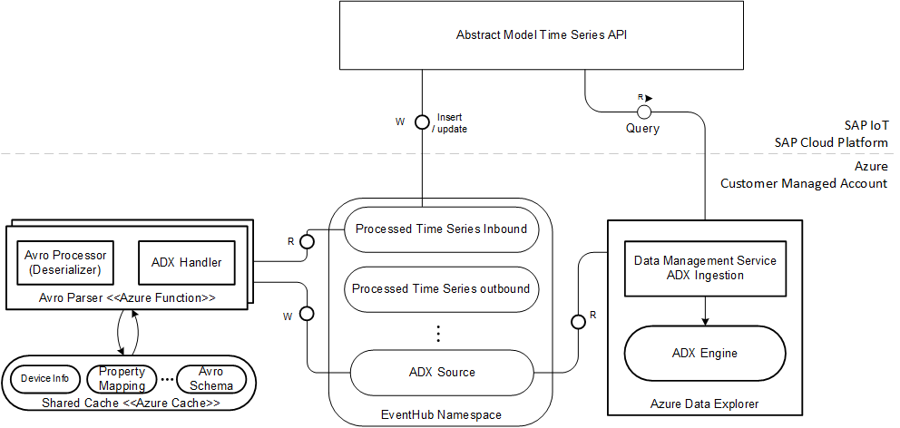
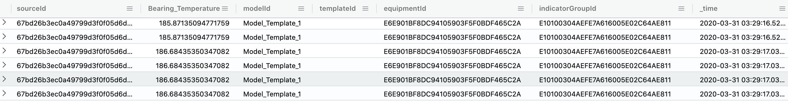

# Overview

In addition to data being ingested from device to IoT Hub, SAP IoT provides REST-based APIs to ingest time series data.

With customer-managed ingestion and data persistance scenario in Azure, requests to write time series data APIs of SAP IoT is processed, and the time series data is sent to Azure Event Hub following SAP-defined Processed-Timeseries Avro Schema. These messages are ingested into the corresponding table in Azure Data Explorer (ADX).

Please refer to SAP documentation on Processed-Timeseries Avro Schema: [Streaming Data using Message Broker](https://help.sap.com/viewer/224d189da0314339a1dd99489de10e48/latest/en-US/6547d6f2a54c48f2a4d8469a9c523812.html) 

Azure Data Explorer (ADX) supports the following ingestion methods:

- Ingestion via Pipeline / Connectors / Plugins like EventHub
- Programmatic Ingestion using SDKs
- Ingestion using Integration Services

For more information on Azure data ingestion methods, refer to [Data Ingestion for Azure Data Explorer](https://docs.microsoft.com/en-us/azure/data-explorer/ingest-data-overview)

In this reference template, ingestion is done using Azure EventHub Connector mechanism for ADX. 
 
## Architecture 

SAP IoT Customer-managed Data Persistence and Streaming Abstraction forwards the time series data inserted via REST-based API to a message queue configured using the Hyperscaler Resource Configuration Service in the customer-managed Azure landscape. The Avro messages are deserialized and written to the ADX source topic in JSON format. The following block diagram shows the components involved for data ingestion via write time series data REST-based API in customer-managed persistence scenario.

## AvroParser Function

### Steps

- AvroParser function consumes the list of Processed Timeseries data messages in Avro format as List<byte[]>, along with Event Hub's system-properties. System properties consists of offset-number, sequence-number, enqueued-time-utc, and partition-key.
- Each consumed Avro message contains both the Avro schema and the records in the message payload in bytes format. 
- StructureId, extracted from partition-key is used to check the existence of ADX tables on Azure. The appropriate table is created, if it does not exist.
- Avro messages are deserialized to JSON format, which then creates the Processed Message Map for sending the data to ADX Source Event Hub.
- The EventHub connection for ADX (configured) consumes the messages based on ingestion policy configured (configured during the table creation). The default
 configuration is batching ingestion policy with 1 minute batching time span. 
- The messages are then persisted into the respective ADX table provided as part application properties in the message.   

### Environment Variables

| ENV_NAME        | Sample Value           | Description  |
| ------------- |:-------------|:-------------|
| processed-timeseries-in-connection-string | Endpoint=sb://\<FQDN\>/;SharedAccessKeyName=\<KeyName\>;SharedAccessKey=\<KeyValue\>;EntityPath=\<processedTimeSeriesInName\>      |    Processed time series in connection string from azure resource |
| processed-timeseries-in-eventhub |  sap.iot.abstract.processed_timeseries_in.v1    |   Processed Time Series Eventhub |

Note: The packaged version of Ingestion Functions deployed to Azure, configures all the environment variables.

### Processing of messages in Azure Ingestion functions

#### Write Time Series Data API

POST Request: <<api-endpoint\>>/Timeseries/v1/Measurements
 
When write time series data API is invoked with request payload as shown below.

      {
       "Tags": {
         "objectId": "384109E0F2534A6A382501",
         "equipmentId": "384109E0F2534A6A382501",
         "indicatorGroupId": "E10100304AEFE7A616005E02C64AE811",
         "modelId": "FC3BE38F63334009958761B997859710"
       },
       "Values": [
         { 
          "_time": "2019-12-09T19:17:25.028Z", 
          "Oil_Level": 78.9, 
          "Inflow_Temperature": 47.3, 
          "Bearing_Temperature": 10.4 
        }
       ]
     }

#### Sample Avro Message in Processed timeseries IN EventHub 

The processed timeseries topic of the IN eventhub is invoked and Avro message is serialized. AVRO message input is in byte[] format, as shown below in the sample.

     [79, 98, 106, ..., 9, 97, -86, 13 ...]
     
#### AvroParser Function Processing

Ingestion Write Function reads Avro messages along with system properties and returns a ProcessedMessageMap after deserialization.

##### Sample ProcessedMessageMap after deserialization

     {
       "S1": {
         "sourceId": "06f1eb701a334b429513da946cb1ed57",
         "structureId": "E10100304AEFE7A616005E02C64AE811",
         "tenantId": "fd7d1261-3e73-4652-b8b1-245da32ecc53",
         "measures": [
           { 
             "_time": "2019-12-09T19:17:25.028Z", 
             "Oil_Level": 78.9, 
             "Inflow_Temperature": 47.3, 
             "Bearing_Temperature": 10.4 
           }
         ],
         "tags": [
           {
             "modelId": "FC3BE38F63334009958761B997859710",
             "equipmentId": "384109E0F2534A6A382501",
             "indicatorGroupId": "E10100304AEFE7A616005E02C64AE811"
           }
         ]
       }
     }
     
#### ADX Source EventHub Format

The ProcessedMessageMap will be written to ADX source topic in an asynchronous manner. The ADX Table Manager will then create the following table with the name "SAP__{StructureId}" using the following table properties in ADX, if it does not exist.

     {
       "appliationProperties": {
         "Table": "SAP__{StructureId}",
         "Format": "MULTIJSON",
         "IngestionMappingReference": "<<StructureId>>" 
       },
       "body": {
         "sourceId":"{sourceId}",
         "_time":"{eventTime}",
         "_isDeleted": false,
         "measurement": {
           "<<prop1>>":"<<val1>>",
           "<<prop2>>":"<<val2>>",
           "<<tagKey1>>":"<<tagVal1>>",
           "<<tagKey2>>":"<<tagVal2>>"
         }
       }

#### ADX Table

Data written to ADX can be queried using Kusto Query Language on ADX

     SAP__E10100304AEFE7A616005E02C64AE811
     | order by _time desc

For more information on Azure Kusto Query Language, refer to [Kusto Query Language Reference Documentation](https://docs.microsoft.com/en-us/azure/data-explorer/kusto/query/)
