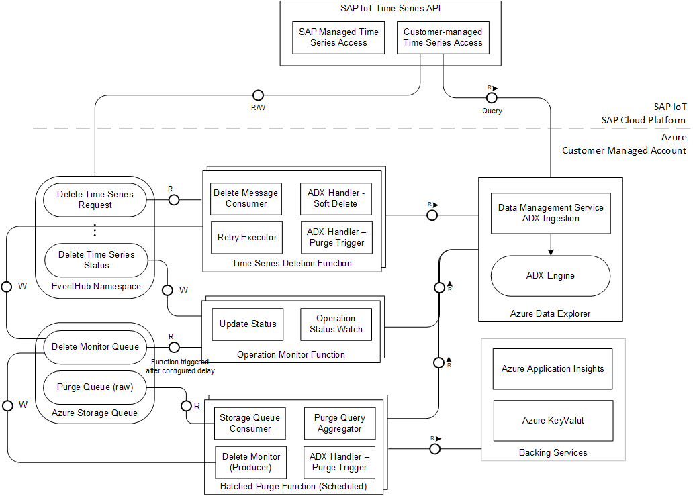

# Delete Time Series

## Overview
The delete time series function in the reference template is responsible for handling delete time series requests from an SAP IoT application. When time series
 data is deleted from within an SAP IoT Business Application (e.g., Digital Supply Chain Applications), the SAP IoT Abstraction layer marks the respective data for deletion and forwards the delete request to the Azure IoT Stack using a message-based asynchronous request-response integration.

The Delete Time Series function has the following key features:

- Consume message from Delete Time Series Request Event Hub
- Process the message and delete the data from the ADX table based on the request
- Write the operation ID returned from the asynchronous ADX delete operation to a Storage Queue
- Check the operation status using a Storage Queue triggered function and, once completed write the async delete time series status to the Delete Time Series Status Event Hub. This message will be consumed from SAP IoT layer and set the deletion status to completed

## Architecture
The following block diagram shows an overview of the components involved in the handling of delete time series requests:



- **Time Series Deletion Function** - processes the messages from Delete Time Series Request Event Hub. Executes the delete query against the Azure Data
 Explorer and forwards the operation ID to the storage queue.
- **Delete Time Series Monitor Function** - consumes the operation IDs from the storage queue. Once completed it writes the status into the status queue.
- **Delete Operations Azure Storage Queue** -  stores the delete request operation IDs.
- **Event Hub Namespace** - includes two event hubs that are used in the context of this function namely Time Series Delete Request and Time Series Delete
 Status Event Hub. 
- **Azure Application Insights** - is used to capture logs and metrics from this function
- **Azure Key Vault** - Delete Time Series Function is registered as Managed Identity, and has the permission to access Key Vault Secret. Using Azure 
[KeyVault Reference](https://docs.microsoft.com/en-us/azure/app-service/app-service-key-vault-references), the function fetches the credentials to access
 Storage Queue and Event Hubs.     

## Delete Time Series Request - Process Flow
In the following diagram it is shown how the delete request is processed by the Delete Time Series API, forwarded to the Azure Function and eventually formed
 into and ADX query:
 

 - When the Abstract Time Series API receives a delete request, this request is forwarded to the delete time series Event Hub.
 - After forwarding the request the Time Series API also stores information about the delete request in a marker table. 
 - The Time Series Deletion Function consumes the requests from the Event Hub and executes the delete query against the Azure Data Explorer. 
 - Since the delete query is an asynchronous operation and might outlive the Azure Function, the delete queries operation ID is forwarded to a storage queue. 
 
In the next sequence diagram, the monitoring of the ADX delete operation is depicted: 
 
## Message Formats
The message schema is based on the Cloud Events ([cloud-events v1.0](https://github.com/cloudevents/spec/blob/v1.0/spec.md)) format.
### Delete Request
The Delete Message
```json
{
    "specversion": "1.0",
    "type": "com.sap.iot.abstraction.timeseries.request.v1",
    "source": "sap-iot-abstraction",
    "id": "1b8a80e9-7903-4c63-83c3-2ca4545a965a",
    "time": "2020-08-14T20:01:27.344Z",
    "comSapIoTAbstractionExtension": {
        "correlationId": "dcd1f2b8-d9c1-11ea-87d0-0242ac130003"
    },
    "datacontenttype": "application/json",
    "data": {
        "sourceId": "sampleSource",
        "structureId": "E10100304AEFE7A616005E02C64AA892",
        "ingestionTimestamp": "2020-08-14T20:01:27.344Z",
        "fromTimestamp": "2020-01-02T00:00:00.000Z",
        "toTimestamp": "2020-01-03T10:00:00.000Z"
    }
}
```

### Operation Info
The Operation Info message containing the delete operation ID along other associated information.
```json
{
    "operationId": "3ba3ac53-79bf-4104-bdc4-37291eba02a4",
    "eventId": "1b8a80e9-7903-4c63-83c3-2ca4545a965a",
    "structureId": "E10100304AEFE7A616005E02C64AA892",
    "correlationId": "dcd1f2b8-d9c1-11ea-87d0-0242ac130003"
}
```

### Delete Time Series Status
The Delete Time Series Status Cloud Event Message that is written to the Operation Status Event Hub:
```json
{
  "specversion": "1.0",
  "type": "com.sap.iot.abstraction.timeseries.status.v1",
  "source": "sap-iot-abstraction",
  "id": "1b8a80e9-7903-4c63-83c3-2ca4545a965a",
  "time": "{time_iso_format)",
  "comSapIoTAbstractionExtension": {
    "correlationId": "dcd1f2b8-d9c1-11ea-87d0-0242ac130003"
  },
  "datacontenttype": "application/json",
  "data": {
    "eventId": "{source_event_id}",
    "status": "{SUCCESS|FAILED}",
    "error": {}  
  }
}
```
- **eventId**: This value is the source Event Id that is passed from the delete request
- **status**: This is the Delete Operation Status passed to Event Hub which has either a SUCCESS/FAILED value. In this reference implementation this is 
represented by [DeleteStatustoEventhub](../timeseries-delete/src/main/java/com/sap/iot/azure/ref/delete/model/DeleteStatustoEventhub.java)
- **error**: Error message that is passed if status is failed.
- **correlationId**: This value is the source correlation Id that is passed from the delete request

In our implementation the [DeleteMonitoringProcessor](../timeseries-delete/src/main/java/com/sap/iot/azure/ref/delete/storagequeue/DeleteMonitoringProcessor.java) passes the [DeleteStatusMessage](../timeseries-delete/src/main/java/com/sap/iot/azure/ref/delete/model/DeleteStatusMessage.java) to 
[DeleteStatusEventHubProcessor](../timeseries-delete/src/main/java/com/sap/iot/azure/ref/delete/output/DeleteStatusEventHubProcessor.java) to create
the Delete Time Series Status Cloud Event Message that is passed to the Operation Status Event Hub.

## Function App Configuration
Here are the Environment Variables that need to be configured for the application:

| ENV_NAME        | Sample Value           | Description  |
| ------------- |:-------------|:-------------|
| adx-resource-uri | https://\<adx-resource-name\>.\<adx-resource-location\>.kusto.windows.net   |  ADX resource URI |
| adx-database-name | \<adx-database-name\>      |  ADX database name |
| service-principal-application-client-id |  \<ClientIdValue\>  |  Client ID for service principal |
| service-principal-application-key |  \<KeyValue\>  |  Key for service principal |
| service-principal-authority-id |  \<AuthorityIdValue\>  |  Authority ID for service principal |
| delete-timeseries-eventhub-connection-string | Endpoint=sb://\<FQDN\>/;SharedAccessKeyName=\<KeyName\>;SharedAccessKey=\<KeyValue\>;EntityPath=\<eventHubName\> | Adx connection string  |
| operation-storage-connection-string |  Endpoint=sb://\<FQDN/\>;SharedAccessKeyName=\<KeyName\>;SharedAccessKey=\<KeyValue\>;EntityPath=\<storageQueueName\>|  Operation Storage Queue name |
| delete-status-eventhub-connection-string |  Endpoint=sb://\<FQDN/\>;SharedAccessKeyName=\<KeyName\>;SharedAccessKey=\<KeyValue\>;EntityPath=\<eventHubName\>|  Delete status Event Hub connection string |

## Delete Time Series Function

The Delete Time Series function consumes the delete requests from the according Event Hub. It then forms and executes the ADX delete query. 
The operation ID which is returned from the delete query is then written into te according Storage Queue.

### Soft Delete
A soft delete is realized by re-ingesting the affected entries with the delete flag set to true.
For understanding the specifics of the soft delete logic, it is important to understand how time series data is selected from ADX.
Therefore, here a sample read time series query:
```
TEST_IG2
| where _time >= datetime(2020-04-23T01:00:00.000Z) and _time <= datetime(2020-04-23T23:59:59.000Z)
| where sourceId in ('s1')
| summarize arg_max(_enqueud_time, *) by sourceId, _time
| where _isDeleted = false
| project-away _enqueud_time
| order by _time desc
```
In this sample query, there are two lines which are crucial for understanding the soft delete logic:
1. **'summarize arg_max(_enqueud_time, \*) by sourceId, _time'**

    The 'summarize arg_max' statement of this sample query expresses that if multiple data entries exist with the same 'sourceId' and '_time' values, only the one
 with the highest '_enqueued_time' value is considered.

1. **'_where _isDeleted = false'**   

    Entries will only be selected, if the value of the '_isDeleted' is equal to 'false'.

Following a sample soft delete query:
```
.set-or-append async  <| 
 | where (_time >= datetime("2020-04-23T01:00:00.000Z")
   and _time <= datetime("2020-04-23T23:59:59.000Z"))
   and sourceId in ("s1")
   and ingestion_time() < datetime("2020-10-23T01:00:00.000Z") 
 | where _isDeleted != true
 | extend _enqueued_time = now(), _isDeleted = true
```
The soft delete query re-ingests the time series data for a given time range and source id.
The only fields which are changed are '_enqueued_time' and '_isDeleted'. 

Considering how the described read time series query works, it becomes clear how this newly ingested data masks the original data. Since it has the same
 'sourceId' and '_time' values and a higher '_enqueued_time' value as the original data, it will mask the original data. Since we also changed the '_isDeleted
 ' value to 'true', the read time series query will not return these entries.  

> Note: In future, data purge will be enabled additional to the soft delete. As of now, only soft delete is supported. 

### Error Handling
The Delete Time Series Function uses the [RetryTaskExecutor](../integration-commons/src/main/java/com/sap/iot/azure/ref/integration/commons/retry/RetryTaskExecutor.java)
to implement a custom retry logic. More details can be found in the [Error Handling Documentation](ErrorHandling.md).
Unlike other Azure Functions, the Delete Time Series Function uses a single trigger cardinality. Therefore, it consumes and processes each delete request
 individually.

## Delete Time Series Monitor

The Delete Time Series Monitor function is used for monitoring the status of the Delete Operation (purge / soft-delete) query.
The Delete Time Series function pushes the monitoring message with the operation Id of the async ADX operation that needs to be
 monitored to the storage queue (delete-operation-monitoring-queue). 
The Delete Time Series Monitor function then consumes this message from the queue. The Delete Monitoring Processor queries ADX for the operation status for
 this operation ID.
Depending on the status the following actions are taken:

1. If the Delete operation is completed, a status of success is written to the Delete Status Event Hub which is subscribed by the SAP IoT Abstraction layer.
2. If the Delete operation has failed or has a bad input, the failed status is written to the Delete Status Event Hub. 
3. If the Delete operation is still in progress, some additional time along with a jitter is added to the next visible time for queue message and
the message is pushed back into the queue to continue its monitoring.

### Error Handling
For the Delete Time Series Monitor function there is built-in retry support since this is a Azure Queue storage trigger.
By default, queue triggers retry requests up to five times. After the fifth retry, Azure Queue storage triggers message to be written to a poison queue, which
is created automatically when the need arises.
