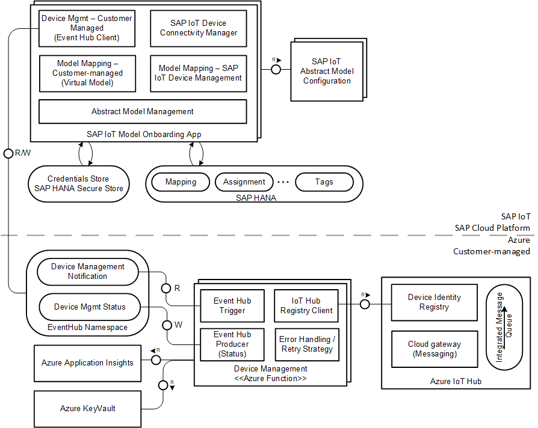
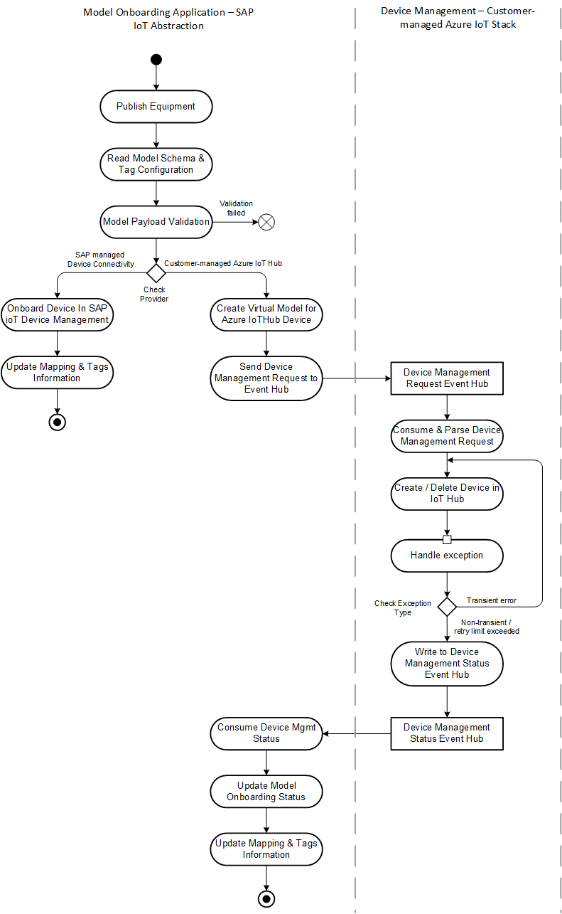

# Device Management Function

The device function in the reference template allows managing of device in Azure IoT Hub. When an equipment is published from an SAP IoT Application (e.g., Asset Central), the consuming application triggers the model onboarding in SAP IoT Abstraction Layer. In case of customer-managed tenant configuration, the SAP IoT Abstraction layer forwards the device creation / update / deletion request to Azure IoT Stack in addition to creating the mapping, assignment and tags information in the SAP Mapping services.  

The Device Management function has the following key features 

- Consume message from Device Management Request Event Hub
- Process the message and create or delete the device in Azure IoT Hub based on the request
- Write the status of device management to Device Management Status Event Hub
- In case of any exceptions in interacting with Azure IoT Hub Registry, the function retries in case of transient errors for configured number of times. In case of permanent error or retry has exceeded maximum allowed, error is written to the Device Management Status Event Hub

## Architecture Overview 

The following block diagram shows an overview of components involved in device management on Customer-managed Azure IoT Hub from SAP IoT Abstraction Layer. The micro services in SAP IoT Abstraction layer sends and receives device management request and status message respectively to the Customer-managed Azure components. 



### Customer-managed Azure Stack Components

- **Device Management Function** - processes the messages from Device Management Request Event Hub, either creates or deletes the device in IoT Hub and writes the status back to Device Management Status Event Hub. The function has four components
  - Event Hub Trigger configuration from the Device Management Status  Event Hub. The trigger is configured with a cardinality of ONE unlike other functions where batching is enabled. 
  - IoT Hub Registry Client - uses the IoT Service SDK to manage the device in Azure IoT Hub.
  - Error Hanndlign & Retry - categorizes an exception from IoT Hub Registry as either transient and non-transient error, and handles retries accordingly. 
  - Event Hub Producer - the status of device management in Azure IoT Hub is written back to the Device Management Status Event Hub. 
- **Event Hubs Namespace** includes two event hubs that are used in the context of this function namely Device Management Request and Device Management Status Event Hub. 
- **Azure Application Insights** is used to capture logs and metrics from this function
- **Azure Key Vault** - Device Management Function is registered as Managed Identity, and has the permission to access Key Vault Secret. Using Azure 
[KeyVault Reference](https://docs.microsoft.com/en-us/azure/app-service/app-service-key-vault-references), the function fetches the credentials to access IoT Hub and Event Hubs. 
- **Azure IoT Hub** - IoT Hub for maintaining the device corresponding to Equipment in SAP Business Application. 

### Device Management Processing Flow


The activity diagram captures the steps involved in Equipment onboarding and device creation in Azure Io T Hub for SAP IoT tenant with customer managed Device Connectivity Solution. 

1. An equipment is published in a consuming SAP IoT Application (e.g., Asset Central), and the equipment onboarding is trigger in SAP IoT Abstraction Layer

2. IoT Abstraction layer reads the schema configuration & tags for this model and validates the payload. If the validation fails, error response is retured to the consuming application

3. If the tenant is configured with **SAP-managed** Device Connectivity, Ingestion and Persistence, then corresponding device is created in the SAP-managed Device Connectivity solution. 

   > Details of device management in SAP-managed Device Connectivity is outside the scope of this documentation

4. If the tenant is configured as **Customer-managed** steps are executed 

   1. Mapping is established to map the device telemetry payload to the application model defined SAP IoT Application. This mapping represents the relationship between device, sensor and capability ids that are sent in the device telemetry payload to the respective artifacts in SAP IoT Application.  The details of mapping is captured in section **Mapping Device Telemetry to Application Model**

   2. Device Management request is sent to the Azure Event Hub (logical type - DeviceManagementRequest)

      > Note: With current release, SAP IoT Abstraction continues to complete the model onboarding on Abstraction layer, and doesn't wait for the response from Customer-managed Azure Stack. 

   3. Device Management Azure Function consumes the message from Event Hub and carries out the respective handling based on the event type

      1. **Event Type - com.sap.iot.abstraction.device.management.create.v1** 

         1. If the device is not existing in Azure IoT Hub, the device is created.
      2. In case device already exits, no action is required 
         3. The message contains device payload structure information (such as sensor & capability) in addition to the required deviceId. The additional information is not used in the current implementation. 
   
         > The sample provided in this reference template only supports creating device with generated Symmetric Key. In case, your implementation rquires device setup with other authentication supported by Azure IoT Hub, you can extend the implementation accordingly. 

         > Supported Device Authentication mechanism is captured in the [Azure IoT Hub Security Guide](https://docs.microsoft.com/en-us/azure/iot-hub/iot-hub-devguide-security) documentation

      2. **Event Type - com.sap.iot.abstraction.device.management.update.v1**

         1. The update event is trigged when a sensor is added to an existing equipment
      2. The reference app only checks the existence of the equipment to ensure that device exists, since the additional meta information is not used in the current implementation
   
      3. **Event Type - com.sap.iot.abstraction.device.management.delete.v1**

         The device if existing is deleted from Azure IoT Hub Identity Registry 

   4. If any exception occurs in the interaction with Azure IoT Hub Device Registry, it's retried based on the exception type. The retry handling is similar to handling in other Functions in the reference application

      1. In case of transient exception, the interaction is executed again with exponentially increasing backoff for a configured maximum number of retries
   2. In case of non-transient exception, the task is not retried. And an error message is written to the Device Management Status Event Hub in the format specified in sub-section **Deivce Management Status Message Format**
   
      Details of classifying exception type as transient & non-transient is maintained in the section Error Handling & Retry

   5. SAP IoT Abstraction layer consumes the status message, and sets the device onboarding status accordingly. 

   6. The common processes (both to SAP & Customer-managed device connectivity) to store the mapping, assignment and tags details is executed. 

      > In the current release, this step is executed right after step 4-2 (after the device management request message is sent to Azure Event Hub)

   7. If any error happens in post device onboarding step (e.g., during saving the mapping information), the device creation is rolled back by issuing a Device Management Delete Request



> Note: In the current release, the status message sent from Device Management Function is not listened by SAP IoT Abstraction Layer and follows a simple fire-and-forget integration pattern.  
>
> The SAP IoT Abstraction layer expects that device management request message sent is handled with retries to ensure that corresponding action is carried out based on the request. 

### Mapping Device Telemetry to Application Model 

As IoT Hub does not impose a model definition for the device telemetry, the SAP IoT Abstraction defines  a mapping to Abstract Model entities based on the identifiers passed in the device telemetry payload. It's expected that device sends in these key identifiers as part of the device telemetry namely 

- Device Id
- Sensor Alternate Id 
- Capability Alternate Id

IoT Abstraction maintains a mapping from the virtual entities since the sensor and capability IDs passed in the device telemetry does not translate to physical entities in Azure IoT Hub to the Abstract Model entities. When data is received from the IoT Hub device model, the virtual mapping is used to map the values with the abstract model entities. 

Following table, taking example of Asset Central model defines the mapping between Asset Central artifacts and virtual identifiers passed in the payload 

| Asset Central Entities | IoT Hub / Virtual Entities   | Mapping details                                              |
| ---------------------- | ---------------------------- | ------------------------------------------------------------ |
| Equipment              | Device                       | Device Id = Equipment Id                                     |
| Template               | [Virtual] Sensor             | Sensor Alternate Id = Template Name <br />Sensor Alternate Id is sent in the device telemetry<br /><br />Sensor Id =  {DeviceId} + / + {Sensor} |
| Indicator Group        | [Virtual] Capability         | Capability Alternate Id = Indicator Group Name<br />Capability Alternate Id is sent in the device telemetry<br /><br />CapabilityId = Indicator Group Id |
| Indicator              | [Virtual] Capability Property | Property Name = Indicator Name                               |

## Implementation Details

### Function App Configuration

In addition to the default applciation settings required for Function App with Event Hub (namely AzureWebJobsStorage, APPINSIGHTS_INSTRUMENTATIONKEY, WEBSITE_RUN_FROM_ZIP, etc.,) following settings are requried specific to this function. These setting are populated during the ARM template deployment 

| Name                                        | Description                                                  | Sample Value                                |
| ------------------------------------------- | ------------------------------------------------------------ | ------------------------------------------- |
| device-management-request-connection-string | Key Vault Refernce for Device Managemnt Request EventHub Connection String with Shared Access Policy Listen | @Microsoft.KeyVault(SecretUri={secret-URI}) |
| device-management-status-connection-string  | Key Vault Refernce for Device Managemnt Status EventHub Connection String with Shared Access Policy Send | @Microsoft.KeyVault(SecretUri={secret-URI}) |
| iothub-registry-connection-string           | Key Vault Refernce for IoT Hub Connection String with Shared Access Policy registryReadWrite | @Microsoft.KeyVault(SecretUri={secret-URI}) |

 ### Event Hub Configuration 

Following shows the Event Hub configuration & details used in device management function 

| Event Hub Name                                | Default Number of Partitions | Partition Key | Shared Access Policy                                         | Consumer Group                                               |
| :-------------------------------------------- | ---------------------------- | :------------ | :----------------------------------------------------------- | :----------------------------------------------------------- |
| sap.iot.abstraction.device.management.request | 3                            | {deviceId}    | **listen** - Used in Azure function eventhub trigger<br />**send -** Shared in HS Configuration Service | sap-iot-device-management-request-cg<br />Used in Azure Function trigger |
| sap.iot.abstraction.device.management.status  | 1                            | {deviceId}    | **send** - Used in Az Function to write the status message<br />**listen** - Shared in HS Config Service to listen to status from SAP IoT Abstraction Layer | sap-iot-device-management-status-cg<br />To be used in status listener from SAP IoT Abstraction Layer |

### Error Handling & Retry

The function has dependency to following external components, wihch could result in errors and requires resilient handling in such cases. 

- IoT Hub Device Registry 
- Event Hub

Any other exception that arises from parsing the device management request are considered as non-transient exception. 

#### Event Hub

The function interacts with IoT Hub & Event Hub using the Java SDKs from Microsoft. Some of the SDKs have retry mechanism built-in, and does not require any handling in the application code. You can find more details of retry handling from SDKs in [Azure Services Retry Guidance](https://docs.microsoft.com/en-us/azure/architecture/best-practices/retry-service-specific). Based on the documentation, the Event Hub SDKs already include in-built retry mechanism when sending message to Event Hub.  

#### IoT Hub Device Registry

In case of IoT Hub RegistryManager, the retry logic is not out of the box from the SDK, and the function uses the [RetryTaskExecutor](../integration-commons/src/main/java/com/sap/iot/azure/ref/integration/commons/retry/RetryTaskExecutor.java) for handling error and retry strategy. 

The function classifies the error as transient / non-transient, and handles the error accrodingly 

1. In case of **transient exception**, the interaction is executed again with exponentially increasing backoff for a configured maximum number of retries
2. In case of **non-transient exception**, the task is not retried. And an error message is written to the Device Management Status Event Hub in the format specified in the next section. 

The class [IoTHubClient](https://github.wdf.sap.corp/iot/azure-iot-integration-ref/blob/master/device-management-functions/src/main/java/com/sap/iot/azure/ref/device/management/iothub/IoTHubClient.java) includes the logic for classifying IoT Hub Exception (sub class of IoTHubException) as either transient or non-transient, and includes respective handling. 

## Message Format

The message schema is based on Cloud Events ([cloud-events v1.0](https://github.com/cloudevents/spec/blob/v1.0/spec.md)) format format for interactions between SAP IoT Abstraction Asset onboarding and Customer-managed Azure IoT Hub. 

#### Device Create Request 

```json
{
  "specversion": "1.0",
  "type": "com.sap.iot.abstraction.device.management.create.v1",
  "source": "sap-iot-abstraction",
  "id": "1b8a80e9-7903-4c63-83c3-2ca4545a965a",
  "time": "2020-06-05T17:31:00Z",
  "comSapIoTAbstractionExtension": {
    "transactionId": "a1b3032f-cb1b-4539-8b4b-bd87664af99a",
    "sequenceNumber": "0"
  },
  "datacontenttype": "application/json",
  "data": {
    "deviceId": "d1",
    "deviceAlternateId": "d1",
    "sensors": [
      {
        "sensorId": "d1/ref1",
        "sensorAlternateId": "ref1",
        "operation": "ADD",
        "capabilities": [
          {
            "operation": "ADD",
            "capabilityId": "c1"
          },
          {
            "operation": "ADD",
            "capabilityId": "c2"
          }
        ]
      }
    ],
    "capabilities": [
      {
        "capabilityId": "c1",
        "capabilityAlternateId": "c1",
        "operation": "ADD",
        "properties": [
          {
            "name": "p1",
            "type": "Numeric",
            "operation": "ADD"
          }
        ]
      },
      {
        "capabilityId": "c2",
        "capabilityAlternateId": "c2",
        "operation": "ADD",
        "properties": [
          {
            "name": "p2",
            "type": "Numeric",
            "length": "10,2",
            "operation": "ADD"
          }
        ]
      }
    ]
  }
}
```

#### Device Update Request 

```json
{
  "specversion": "1.0",
  "type": "com.sap.iot.abstraction.device.management.update.v1",
  "source": "sap-iot-abstraction",
  "id": "1b8a80e9-7903-4c63-83c3-2ca4545a965b",
  "time": "2020-06-05T17:31:00Z",
  "comSapIoTAbstractionExtension": {
    "transactionId": "a1b3032f-cb1b-4539-8b4b-bd87664af99b",
    "sequenceNumber": "0"
  },
  "datacontenttype": "application/json",
  "data": {
    "deviceId": "d1",
    "deviceAlternateId": "d1",
    "sensors": [
      {
        "sensorId": "d1/ref1",
        "sensorAlternateId": "ref1",
        "operation": "UPDATE",
        "capabilities": [
          {
            "capabilityId": "c3",
            "operation": "ADD"
          }
        ]
      },
      {
        "sensorId": "d1/ref2",
        "sensorAlternateId": "ref2",
        "operation": "ADD",
        "capabilities": [
          {
            "capabilityId": "c3",
            "operation": "ADD"
          }
        ]
      }
    ],
    "capabilities": [
      {
        "capabilityId": "c3",
        "capabilityAlternateId": "c3",
        "operation": "ADD",
        "properties": [
          {
            "name": "p3",
            "type": "Numeric",
            "operation": "ADD"
          }
        ]
      }
    ]
  }
}
```

#### Device Delete Request

```json
{
  "specversion": "1.0",
  "type": "com.sap.iot.abstraction.device.management.delete.v1",
  "source": "sap-iot-abstraction",
  "id": "1b8a80e9-7903-4c63-83c3-2ca4545a965c",
  "time": "2020-06-05T17:31:00Z",
  "comSapIoTAbstractionExtension": {
    "transactionId": "a1b3032f-cb1b-4539-8b4b-bd87664af99c",
    "sequenceNumber": "0"
  },
  "datacontenttype": "application/json",
  "data": {
    "deviceId": "d1",
    "deviceAlternateId": "d1"
  }
}
```


#### Deivce Management Status 

```json
{
  "eventType": "com.sap.iot.abstraction.device.management.(create|delete|update).status.v1",
  "id": "85ed0b4b-e7c8-47ab-9502-3b7873e43e1c",
  "source": "customer-managed-azure-iot",
  "specversion": "1.0",
  "type": "com.sap.iot.abstraction.device.management.create.status.v1",
  "datacontenttype": "application/json",
  "time": "2020-06-24T02:12:44.298Z",
  "comSapIoTAbstractionExtension": {
    "transactionId": "a1b3032f-cb1b-4539-8b4b-bd87664af99c",
    "sequenceNumber": "0"
  },
  "data": {
    "deviceId": "d1",
    "status": "SUCCESS",
    "error": null
  }
}
```
