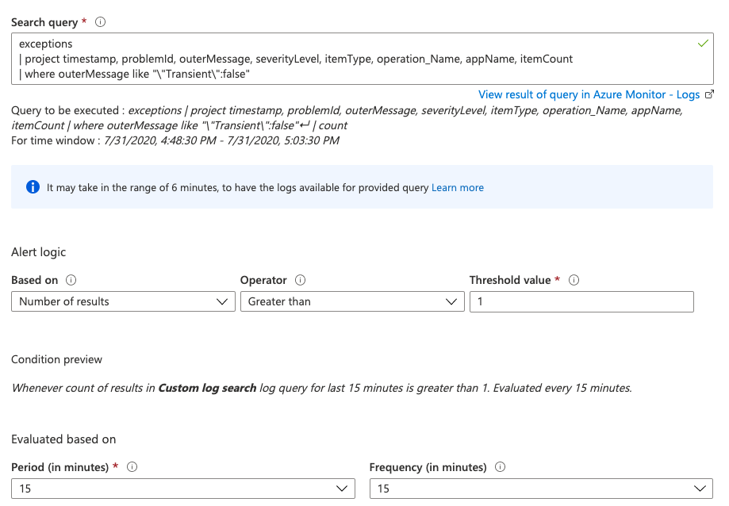
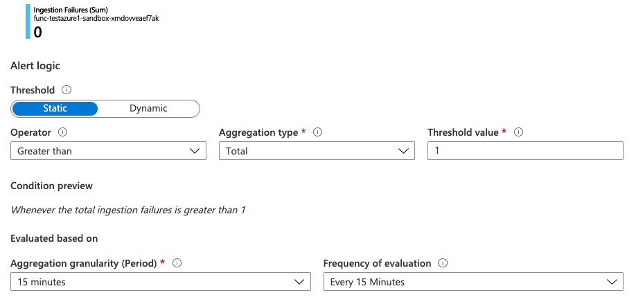

## Application Insights for Monitoring Azure Function Apps 

Application Insights helps to monitor function applications and sends its logging telemetry data to Azure Monitor. The enablement of alerts helps to track an error/exception based on error logs. 

For more information on Azure Application Insights, refer to [Azure Application Insights Overview](https://docs.microsoft.com/en-us/azure/azure-monitor/app/app-insights-overview)

## Categorization of error and their handling

Errors are categorized based on their origins, into following types.

#### Transient Errors

Transient errors are temporary errors which occur during the runtime of an Azure Function. Examples for such errors are failures to access the Azure cache, errors while sending messages to Event Hub, 5XX error codes from SAP IoT Abstract Model Mapping APIs, or failures due to network outages.

Transient errors are handled through a custom retry mechanism. This logic is implemented by the RetryExecutor, which retries a given callable for a maximum of 5 (configurable) times. The RetryExecutor utilizes an exponential backoff starting with one second. If the execution is not successful after the maximum number of retries, the exception will be logged to Application Insights.

Refer to our existing implementation of [RetryTaskExecutor](../integration-commons/src/main/java/com/sap/iot/azure/ref/integration/commons/retry/RetryTaskExecutor.java) for handling error and retry strategy, across all Azure Functions.

#### Non-Transient Errors

Non-transient errors are the ones which are permanent errors viz. invalid message format or invalid API endpoints. Appropriate error logs are written to Application Insights for such errors.

## Error codes in Function Apps

| Error Code       | Description    |
| ------------- |-------------|
| AVRO_EXCEPTION    | Invalid or incorrect avro message/format during parsing |
| ADX_ERROR | Unable to create components on ADX  |
| CACHE_ACCESS_ERROR | Unable to access redis cache |
| EVENT_HUB_ERROR | Unable to access event hub |
| MAPPING_LOOKUP_ERROR | Incorrect device mapping information or lookup error |
| MAPPING_LOOKUP_ERROR | Incorrect device mapping information or lookup error |
| INVALID_DEVICE_MESSAGE | Unable to parse device message to valid SAP IoT device model format |
| INVALID_PROCESSED_MESSAGE | Invalid processed message with no avro schema |
| INVALID_TIMESTAMP | Invalid timestamp |
| JSON_PROCESSING_ERROR | Unable to prepare json mapping during ingestion |

## Configuring Alerts

Azure Application Insights can provide live monitoring of metrics from the Function Apps, and help detect performance anomalies with analytical tools. In the context of the references template for ingestion, the logs from Function Apps are streamed to Application Insights, and rules are configured to trigger alerts based on the log search or metrics.

### Alerts Configured in Ingestion ARM Template

The alerts for various other azure resources are configured based on the metrics. For more information, refer to the [Monitoring and Alert documentation](https://github.wdf.sap.corp/iot/azure-iot-integration-ref/blob/master/doc/ARMMonitoringAndAlerts.md#alerts). For general information on Azure Application Insights alerts, refer to [Azure Application Insights Alerts Reference](https://docs.microsoft.com/en-us/azure/azure-monitor/app/alerts)

### Sample Alerts based on log exceptions

#### Alerts based on Non-Transient Errors:

Attached below is the screenshot for one of the alert rules created to detect non-transient errors with a search query condition,

    exceptions | project timestamp, problemId, outerMessage, severityLevel, itemType, operation_Name, appName, itemCount | where outerMessage like ""Transient":false"

The severity level for non-transient errors is set to "ERROR". The possible severity levels are documented in [Azure Alerts documentation](https://docs.microsoft.com/en-us/azure/azure-monitor/platform/alerts-overview) 

#### Alerts based on Transient Errors:

Attached below is the screenshot for one of the alert rules created to detect transient errors. The severity level for ingestion function failures is also set to "ERROR". The threshold is set to greater than 1, which indicates the alert will be triggered when any function invocation results in an error.

You can assign [Action Group](https://docs.microsoft.com/en-us/azure/azure-monitor/platform/action-groups) to an Alert Rule to trigger notifications After configuring alerts, users are notified within the application using push-notifications by default. Additionally, users can configure Emails, SMS or Voice Messages as their preferred notifications from the app.
