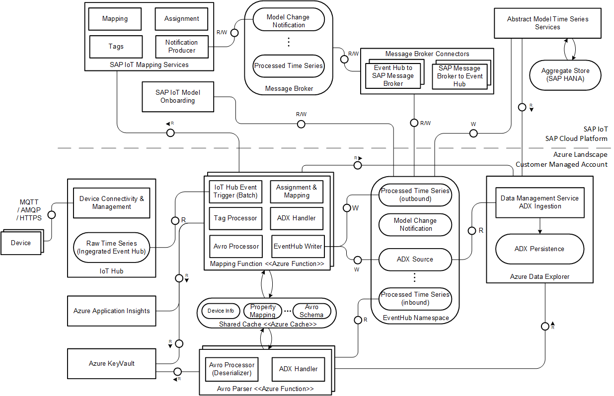

# Ingestion Functions

This document provides details of the Ingestion Functions and their implementation.
Details of the structure of this documentation can be found in the README of doc folder.

The project structure with the two ingestion functions is shown below - the Avro parser function and the Mapping function:

```
└───azure-iot-integration-ref
    ├───ingestion-functions
        ├───AvroParserFunction
        └───MappingFunction
```

## Configuration for Function App

Here are the Environment Variables that need to be configured for the application:

| ENV_NAME        | Sample Value           | Description  |
| ------------- |:-------------|:-------------|
| iothub-connection-string      | Endpoint=sb://\<FQDN/\>;SharedAccessKeyName=\<KeyName\>;SharedAccessKey=\<KeyValue\>;EntityPath=\<eventHubName\>      |   SAP IoT Hub's connection string |
| processed-timeseries-connection-string | Endpoint=sb://\<FQDN\>/;SharedAccessKeyName=\<KeyName\>;SharedAccessKey=\<KeyValue\>;EntityPath=\<processedTimeSeriesName\>      |    Processed time series connection string from azure resource |
| transform-default-message-type |  SAPIoTDeviceModel    |   Default message type |
| adx-source-connection-string | Endpoint=sb://\<FQDN\>/;SharedAccessKeyName=\<KeyName\>;SharedAccessKey=\<KeyValue\>;EntityPath=\<adxName\>      |   Adx connection string  |
| adx-database-name | \<adx-database-name\>   |  ADX database name |
| azure-cache-host | \<CacheName\>.redis.cache.windows.net      |  Azure cache host name |
| azure-cache-key |  \<KeyValue\>  |  Azure cache key for connection |
| mappings-api-hostname |  https://\<APIName\>.cfapps.sap.hana.ondemand.com  |  Mapping API hostname |
| azure-cache-key |  \<KeyValue\>  |  Azure cache key for connection |


## Changing Log Level

Log Levels can be changed at an application level by configuring Log Levels in the Application Settings in Azure Functions Cockpit. For example, we can add a setting such as:
```
"AzureFunctionsJobHost__logging__logLevel__Function.Ingestion": "Information"
```
This application setting would configure the logging level for the Ingestion Function to level 'Information'

# Mapping Ingestion Function

## Data Ingestion Architecture



## Ingestion Flow Overview

This diagram shows the steps in the Mapping function for each batch of message.

 

### Mapping APIs and Ingestion Flow

This section shows the ingestion flow. If there is a cache miss the entries are populated into cache interacting with Mapping APIs.
The sequence of flow of these APIs need not be sequential, and can executed in parallel as show in the activity diagram above.
The flow is as follows:

We get the following message from device:

#### Message Payload

Ingestion supports _time value in epoch-milliseconds format (long) and ISO format. If the _time
property is not passed in the payload, then the time at which message arrived in IoT Hub shall be used. The below
payload examples, illustrate the possible _time scenarios:

In Azure IoTHub, the device id is sent in the system-properties field as:
```
iothub-connection-device-id : 384109E0F2534A6A382PEI12
```

**ISO time format:**
```
{
   "capabilityAlternateId": "Rotating_Equipment_Measurements",
   "sensorAlternateId": "RotorSensor",
   "measures": [
      {
         "_time": “2020-07-28T05:08:41.352Z”,
         "Bearing_Temperature": 10,
         “Bearing_Pressure”: 10.2
      }
   ]
}
```

**Epoch-milliseconds time format:**
```
{
   "capabilityAlternateId": "Rotating_Equipment_Measurements",
   "sensorAlternateId": "RotorSensor",
   "measures": [
      {
         "_time": 1595912982259,
         "Bearing_Temperature": 10,
         “Bearing_Pressure”: 10.2
      }
   ]
}
```

**Skipping _time value:**
```
{
   "capabilityAlternateId": "Rotating_Equipment_Measurements",
   "sensorAlternateId": "RotorSensor",
   "measures": [
      {
         "Bearing_Temperature": 10,
         “Bearing_Pressure”: 10.2
      }
   ]
}
```

#### Get Assignment & Mapping

A lookup for Assignment Id and Mappings is done using the API's below if an entry is not found in the cache:

Sensor ID (device Id) → Mapping & Assignment Id

Request: <\<Mapping-API-endpoint>\>/Model/v1/Assignments?$expand=Sensors&$filter=Sensors/SensorId eq '384109E0F2534A6A382PEI12/RotorSensor'&$format=json  

##### Sample Assignment API Response

```json  
 {
   "AssignmentId": "3cd66839-0cc7-4a53-bd50-3d3354d262c4",
   "ObjectId": "384109E0F2534A6A382501",
   "MappingId": "15b9fddc-baf3-4985-ba13-75ae2cea5dc8",
   "Sensors": {
                "results": [
                     {
                       "SensorId": "384109E0F2534A6A382501/RotorSensor",
                       "SensorType": "RotorSensor"
                     }
                 ]
            }
 }
```

Please refer to the SAP help documentation for more information and examples for Assignment request: [Assignment API Reference](https://help.sap.com/viewer/224d189da0314339a1dd99489de10e48/latest/en-US/0256be66db6b49d286a330fd89225f4c.html)

Get Mapping Info given Mapping ID from the previous entry; Yields --> mapping info for all Structure ID & virtual capability IDs

Request: <\<Mapping-API-endpoint>\>/Model/v1/Mappings('15b9fddc-baf3-4985-ba13-75ae2cea5dc8')?$expand=Measures, Measures/PropertyMeasures&$format=json


##### Sample Mapping API Response

```json
{
 "MappingId": "15b9fddc-baf3-4985-ba13-75ae2cea5dc8",
 "MappingName": "Industry4_DSC_Mapping",
 "Provider": 2,
 "Descriptions": {},
 "Measures": {
            "results": [
              {
                "StructureId": "E10100304AEFE7A616005E02C64AE811",
                "CapabilityId": "Rotating_Equipment_Measurements",
                "PropertyMeasures": {
                        "results": [
                            {
                                "StructurePropertyId": "C949D723F6D340F896BC5AE882897777",
                                "CapabilityPropertyId": "Bearing_Temperature"
                            },
                            {
                                "StructurePropertyId": "D736C169G4A219B170AN2AE662592222",
                                "CapabilityPropertyId": "Bearing_Pressure"
                            }
                        ]
                 }
          }

      ]
   }
 }
```
Please refer to the SAP help documentation for more information and examples for Mapping request: [Mapping API Reference](https://help.sap.com/viewer/224d189da0314339a1dd99489de10e48/latest/en-US/927437f4a9f44aad99b63d325337dca4.html)

#### PropertyMappingInfo Cache Entry

For each "measures" json object in the response, we'll make entry into cache.

Key: "SAP_" + "MAPPING_" + {mappingId} + "\_" + {structureId} + "\_" + {capabilityId}

Sample Cache Key: SAP_MAPPING_15b9fddc-baf3-4985-ba13-75ae2cea5dc8_E10100304AEFE7A616005E02C64AE811_Rotating_Equipment_Measurements

##### Sample Cache Entry

```json
{
     "PropertyMeasures": {
                "results": [
                     {
                        "StructurePropertyId": "C949D723F6D340F896BC5AE882897777",
                        "CapabilityPropertyId": "Bearing_Temperature"
                     },
                     {
                         "StructurePropertyId": "D736C169G4A219B170AN2AE662592222",
                         "CapabilityPropertyId": "Bearing_Pressure"
                     }
              ]
       }
}
```
#### Fetch Source ID & tags

Given SensorId & virtual capability id, we can now fetch the source Id & tags using the API's below:

Request: <\<Mapping-API-endpoint>\>/v1/Lookup/Tags?SensorId=384109E0F2534A6A382PEI12/RotorSensor&CapabilityId=Rotating_Equipment_Measurements

##### Sample Tags Lookup API Response

```json
  {
    "sensorId": "384109E0F2534A6A382501/RotorSensor",
    "objectId": "384109E0F2534A6A382501",
    "structureId": "E10100304AEFE7A616005E02C64AE811",
    "sourceId": "06f1eb701a334b429513da946cb1ed57",
    "tenant": "fd7d1261-3e73-4652-b8b1-245da32ecc53",
    "tag": [
        {
            "tagValue": "384109E0F2534A6A382501",
            "tagSemantic": "equipmentId"
        },
        {
            "tagValue": "FC3BE38F63334009958761B997859710",
            "tagSemantic": "modelId"
        },
        {
            "tagValue": "E10100304AEFE7A616005E02C64AE811",
            "tagSemantic": "indicatorGroupId"
        }
    ]
}
```
Please refer to the SAP help documentation for more information and examples for Source Id and Tags request: [Source Id and Tags API Reference](https://help.sap.com/viewer/224d189da0314339a1dd99489de10e48/latest/en-US/aa45de4f2d694e7186a15fbc0a62afb4.html)

#### SensorInfo Cache Entry

A cache entry is made for the device information:

Key: "SAP_" + "SENSOR_" + {sensorId} + "_" + {capabilityId}

Value:
```json
  {
    "sensorId": "384109E0F2534A6A382501/RotorSensor",
    "objectId": "384109E0F2534A6A382501",
    "structureId": "E10100304AEFE7A616005E02C64AE811",
    "sourceId": "06f1eb701a334b429513da946cb1ed57",
    "tenant": "fd7d1261-3e73-4652-b8b1-245da32ecc53",
    "tag": [
        {
            "tagValue": "384109E0F2534A6A382501",
            "tagSemantic": "equipmentId"
        },
        {
            "tagValue": "FC3BE38F63334009958761B997859710",
            "tagSemantic": "modelId"
        },
        {
            "tagValue": "E10100304AEFE7A616005E02C64AE811",
            "tagSemantic": "indicatorGroupId"
        }
    ]
}
```
#### Structure Lookup Avro Schema

We also do a lookup for the Schema. If the schema does not exist in cache the following API can be invoked to get the Avro schema. A cache entry is then made for the corresponding Structure Id.

Request: \<\<Mapping-API-endpoint\>\>/v1/Lookup/AvroSchema?StructureId=E10100304AEFE7A616005E02C64AE811

##### Sample Avro Schema API Response
For a sample Avro schema, please refer to the [Message Broker Documentation](./MessageBroker.md).

Please refer to the SAP help documentation for more information and examples for Avro Schema request: [Avro Schema API Reference](https://help.sap.com/viewer/224d189da0314339a1dd99489de10e48/latest/en-US/b7d7e6ed87534dfaa405a7a56a63a8aa.html)

#### SchemaWithADXStatus Cache Entry

A cache entry is made for the schema information:

Key: "SAP_" + "STRUCTURE_" + {structureId}

Value:

The Avro schema received in the above request is stored along with a boolean value for the adxSync flag.
The adxSync flag is maintained as a part of the value stored in cache to indicate
whether the structure changes are in sync with ADX or not.

#### ADX Table Creation
The Azure reference implementation takes care of creating the required tables in the ADX database.
A table is created for every structure Id.

The name of the table is constructed by prefixing the structure Id with "SAP__". This logic is implemented in the [ADXTableManager](../azure-ref/src/main/java/com/sap/iot/azure/ref/adx/ADXTableManager.java) class.
The column names and types are generated with the information provided of the AVRO schema. A column for every tag and measure field of the AVRO schema. This
 logic is implemented in the [AvroHelper](../integration-commons/src/main/java/com/sap/iot/azure/ref/integration/commons/avro/AvroHelper.java) class.

### Event Hubs Sinks

Once the measures were successfully augmented with the SAP IoT mapping information, the measures are sent to the following two downstream Event Hubs.
1. Processed Time Series Out
2. ADX Time Series

Measures will be written in AVRO format to the **Processed Time Series Out** Event Hub.

Measures are written to the ADX Time Series Event Hub in JSON format. The Azure reference implementation configures this Event Hub as ingestion source for
 ADX.

## Support for device formats

The ingestion flow allows supports the SAP IoT device model device format which can be extended by implementing the interface DevicePayloadMapper as part of the
reference template. The environment variable: "transform-default-message-type" defaults to SAP IoT device model device format.
Only Single and Batched Measure IoT Device Model Message format are supported. For more information, please refer to doc:
[Single and Batched Measure IoT Device Model Message format](https://help.sap.com/viewer/9133dbb5799740f8b1e8a1c3f0234776/2101a/en-US/755de2516dde4fafb446efaaafb2c81a.html#)

### IoT Device Model format

```java
    {
      "capabilityAlternateId": "Rotating_Equipment_Measurements",
      "deviceAlternateId": "Pump_00554",
      "measures": [
        {
        "_time": "2019-12-09T19:17:25.028Z",
          "Oil_Level": 78.9,
          "Inflow_Temperature": 47.3,
          "Bearing_Temperature": 10.4
        }
      ]
    }
```

#### Extending Supported Device Payload Formats

You can extended the support for Device Payload Formats by implementing the DevicePayloadMapper Interface.
The [IoTDeviceModelPayloadMapper](../integration-commons/src/main/java/com/sap/iot/azure/ref/ingestion/device/mapping/IoTDeviceModelPayloadMapper.java) shows how this interface is implemented.

```java
public interface DevicePayloadMapper extends Processor<DeviceMessage, List<DeviceMeasure>> {

    List<DeviceMeasure> map(DeviceMessage message) throws IngestionRuntimeException;

    @Override
    default List<DeviceMeasure> process(DeviceMessage deviceMessage) throws IoTRuntimeException {
        return map(deviceMessage);
    }
}
```

## Model & Mapping Caching

All the mapping, assignment and avro schema information fetched from Mapping Services is cached in Azure using Azure Cache for Redis Service. The environment
 variables "azure-cache-host" and "azure-cache-key" should be set from the Azure Resource Group you are using to ensure connectivity to the cache. Once a
 device message is received, we check if the Device Info, Mapping Info and Schema Info exist in the cache already, if not, the mapping api's are invoked and then the cache is updated.

The values stored in cache are grouped as below, to reduce the number of access to Cache during ingestion.  

| Cache Type        | Key -> Value         | Sample Value       |
| ------------- |:-------------:|:-------------:|
| SensorInfo     | (DeviceId, VirtualCapabilityId) -> (SourceId, Mapping, StructureId, Tags)   | [see above](#sensorinfo-cache-entry) |
| PropertyMappingInfo      | (MappingId, StructID, capabilityId) -> PropertyMappings   | [see above](#propertymappinginfo-cache-entry)   |
| SchemaWithADXStatus | StructureId -> AvroSchema   |   [see above](#schemawithadxstatus-cache-entry )    |

Auth Token Cache   
In addition to above cache types that are looked up from external cache, bearer token for accessing Abstract Mapping services should be cached (only) in-process cache.
