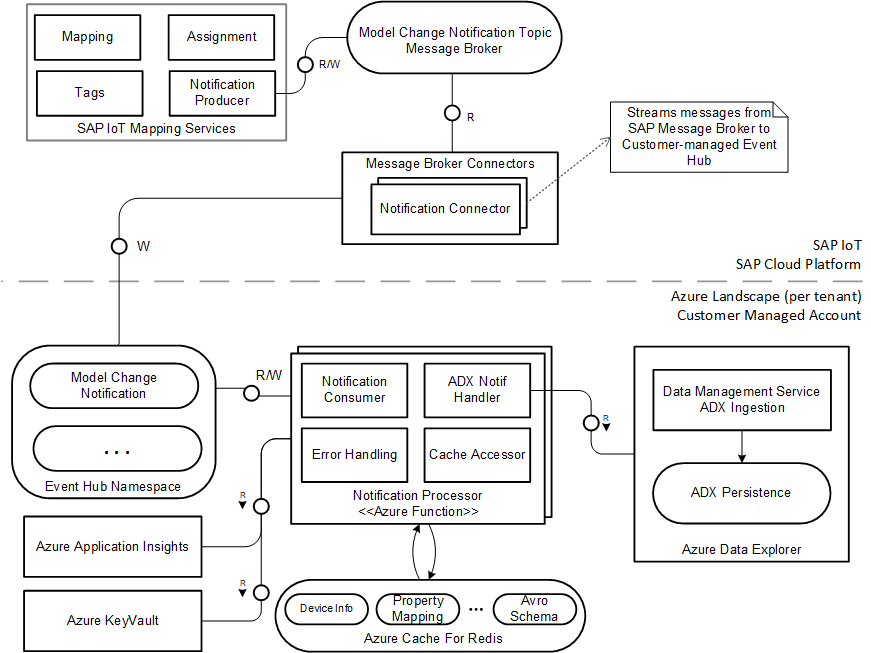
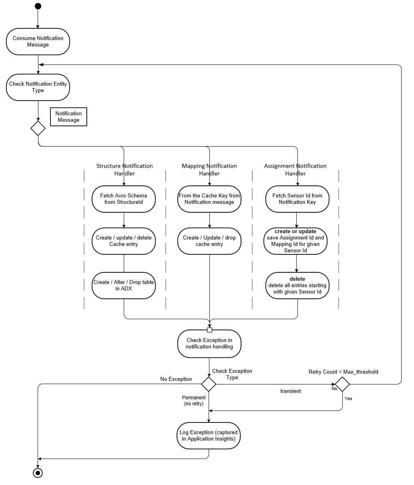
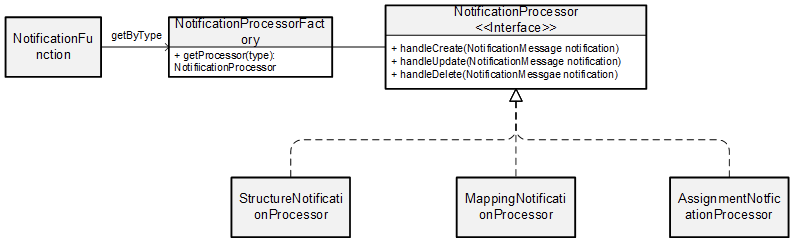
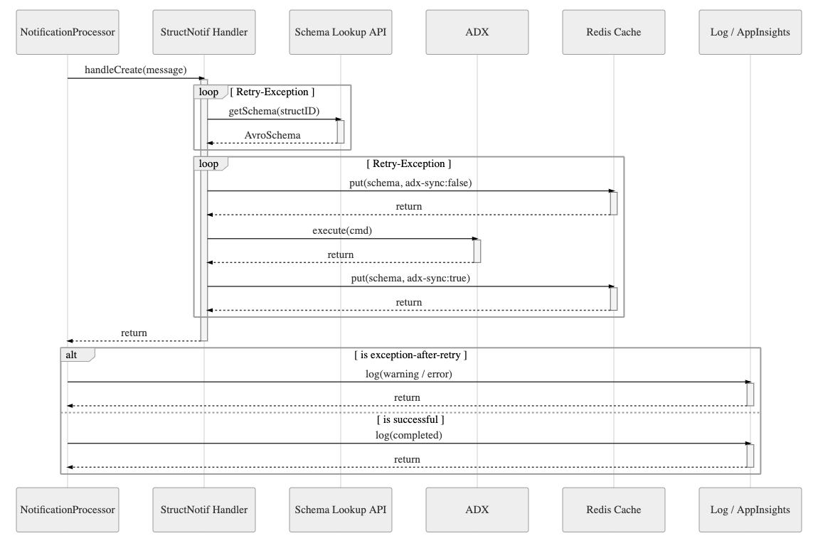

# Notification Processor

## Overview

The Notification Processor Function processes the model change notifications that are generated when any changes are made
to the equipment model in SAP IoT Applications.

Change notifications can be of following types:
- Assignment
- Mapping
- Structure

## Architecture

The Architecture diagram for notification processing:



- Notification topics have only one partition by default
- Partition Key differs based on the notification type
- This is a tenant-independent topic
- The tenant information is available in the partition key as follows {tenantId}/*

EventHub topics Name: sap.iot.modelabstraction.meta.change.v1

- Event Hub is tenant specific.
- Notification topics have only one partition by default
- Partition Key - same as Kafka Message partition key

The unified notifications are then processed by the Notification Processor and the required changes are persisted to
ADX.

## Function App Configuration

Here are the Environment Variables that need to be configured for the application:

| ENV_NAME        | Sample Value           | Description  |
| ------------- |:-------------|:-------------|
| adx-source-connection-string | Endpoint=sb://\<FQDN\>/;SharedAccessKeyName=\<KeyName\>;SharedAccessKey=\<KeyValue\>;EntityPath=\<adxName\>      |   Adx connection string  |
| adx-database-name | \<adx-database-name\>   |  ADX database name |
| azure-cache-host | \<CacheName\>.redis.cache.windows.net      |  Azure cache host name |
| azure-cache-key |  \<KeyValue\>  |  Azure cache key for connection |
| notification-eventhub-connection-string |  Endpoint=sb://\<FQDN/\>;SharedAccessKeyName=\<KeyName\>;SharedAccessKey=\<KeyValue\>;EntityPath=\<eventHubName\>|  Notification's Event Hub connection string |

## Notification Payload Structure

The structure details for the Notification Payload that is received is presented below. For more information on the payload request
structure, please refer API documentation for Model Change Notification.

```javascript
{
    "operation": "<>",
    "timestamp": < > ,
    "type": "<>",
    "changeEntity": "<>",
    "tenant": "<>",
    "version": "<>",
    "changeList": [{
        "type": "<>",
        "entity": "<>",
        "providerEntity": "<>",
        "operation": "<>",
        "descriptions": [],
        "additionalEntityData": [{
            "name": "<>",
            "value": "<>"
        }]
    }],
    "entityDataList": [{
        "name": "<>",
        "value": "<>"
    }]
}
```

- **operation**: This value could be POST, PATCH or DELETE and represents the operation type for the notification received.
In this reference implementation this is represented by [OperationType](../notification-processor/src/main/java/com/sap/iot/azure/ref/notification/processing/model/OperationType.java)
- **type**: This is the type for which the notification was generated. In this reference implementation this is represented by [EntityType](../notification-processor/src/main/java/com/sap/iot/azure/ref/notification/processing/model/EntityType.java)
- **changeEntity**: This is the ID for the Entity Type. For example, for type com.sap.iot.i4c.Mapping, change entity would represent the Mapping ID. In this reference implementation this is represented by
[ChangeEntity](../notification-processor/src/main/java/com/sap/iot/azure/ref/notification/processing/model/ChangeEntity.java)
- **changeList**: This represents the notification update details:
    - type: Type for for the change is required
    - entity: This typically represents the ID for the change entity
    - providerEntity: This typically represents the ID for provider Entity
    - operation: This represents the update operation for which the notification was generated.
    In this reference implementation this is represented by [ChangeEntityOperation](../notification-processor/src/main/java/com/sap/iot/azure/ref/notification/processing/model/ChangeEntityOperation.java)
    - additionalEntityData: This represents the Measure Properties that need to be updated

# Notification Handling

The general overview of notification handling is shown below



Each of the above notification type can triggered with operation type POST (create a certain entity), PATCH (changes to child entities - add, update, delete),
and DELETE.

Each of these different type of change notifications is handled by their own notification
processor as seen in the diagram above. We will now go into the notification processing details
and how each processor handles the incoming notification.

## Detailed Process Handling

The incoming notifications are processed as shown below:




### Notification Processing By Type & Operation

### Structure Notification Handling

The incoming structure notification payload can be of the following types:
**Message Key** <<tenant_name>>/com.sap.iot.i4c.Structure/<<IndicatorGroupId\>>/

| Operation | Scenario & Handling                          | Sample Payload                |
| --------- | -------------------------------------------- | ---------------------------- |
| POST      | **New Structure is created**<br />1. Create a new cache entry for AVRO schema<br />2. Create a table in ADX with type mapping as defined [here](Ingestion.md) | [Create New Structure](#create-new-structure ) |
| PATCH     | **A property is added to an existing structure**<br />1. Fetch the current AVRO schema<br />2. Save current schema in cache<br />3. Add Column to existing table <br />**A property type is changed for an existing structure**<br />1. Fetch the current AVRO schema<br />2. Save current schema in cache<br />3. Update Column datatype for existing table <br />**A property is removed from an existing structure**<br />1. Fetch the current AVRO schema<br />2. Save current schema in cache<br />3. Remove Column from existing table | [Update Structure](#update-structure ) |
| DELETE    | **Structure is deleted**<br />1. Remove cache entry<br />2. Remove ADX table | [Delete Structure](#delete-structure ) |

When the notification is processed and the relevant cache changes are made, a flag called isAdxSync is maintained as a part of the Schema Info in the cache which lets us know if the structure changes are in sync with the ADX table changes. If this flag is false, that means the ADX is currently out of sync and hence a retry attempt to sync ADX will be made based on the latest schema. Once the sync is complete, the flag isAdxSync is set to true and stored in the cache.

#### Structure Notifications

As discussed in the above table, structure notifications handling will differ depending the type of operation for the message and the entity. Each of these
 scenarios are explained in detail below:


##### Create New Structure

```javascript
{
  "operation": "POST",
  "timestamp": 1589218488579,
  "type": "com.sap.iot.i4c.Structure",
  "changeEntity": "E10100304AEFE7A616005E02C64AM110",
  "tenant": "fd7d1261-3e73-4652-b8b1-245da32ecc53",
  "changeList": [{
    "type": "com.sap.iot.i4c.StructureProperty",
    "entity": "Bearing_Temperature_M110",
    "operation": "ADD",
    "additionalEntityData": [{
      "name": "dataType",
      "value": "Numeric"
    }]
  }],
  "version": "0",
  "entityDataList": []
}
```

Once this payload is received, the NotificationHandler delegates the notification to the Structure Notification Processor and is processed by handleCreate.
This function creates fetches the AVRO schema using the Structure ID (changeEntity). This schema is stored in the cache and an ADX table is created based on
this schema.

##### Update Structure

For the update scenario, depending on the incoming payload we can have the following different types of handling.
Once any of the below payloads are received, they are processed by the handleUpdate function in Structure Notification
Processor:

- **Add new property to the structure**

```javascript
{
  "operation": "POST",
  "timestamp": 1589218488579,
  "type": "com.sap.iot.i4c.Structure",
  "changeEntity": "E10100304AEFE7A616005E02C64AM110",
  "tenant": "fd7d1261-3e73-4652-b8b1-245da32ecc53",
  "changeList": [{
    "type": "com.sap.iot.i4c.StructureProperty",
    "entity": "Bearing_Temperature_M110",
    "operation": "ADD",
    "additionalEntityData": [{
      "name": "dataType",
      "value": "Numeric"
    }]
  }],
  "version": "0",
  "entityDataList": []
}
```

The changeList -> operation indicates that this update involves adding a new property. The current AVRO schema is fetched from the mapping API using the
 Structure ID (changeEntity).

 The schema is stored in the cache and the according ADX table is updated using an alter-merge operation.

- **Update property data type**

```javascript
 {
   "operation": "PATCH",
   "timestamp": 1589400718573,
   "type": "com.sap.iot.i4c.Structure",
   "changeEntity": "E10100304AEFE7A616005E02C64AM110",
   "tenant": "643751ab-65be-46f8-b20e-2b648cf42336",
   "changeList": [{
     "type": "com.sap.iot.i4c.StructureProperty",
     "entity": "Bearing_Temperature_M110",
     "operation": "UPDATE",
     "additionalEntityData": [{
       "name": "dataType",
       "value": "String"
     }]
   }],
   "version": "0",
   "entityDataList": []
 }
```

 The changeList -> operation indicates that this update involves updating the data type of an existing property. The current AVRO schema is fetched from
  the mapping API using the Structure ID (changeEntity).

  The schema is stored in the cache. The according ADX column is altered. For forming the query, the column name is derived from changeList -> entity and the new datatype from additionalEntityData -> value.

  The mapping logic of the data type is implemented in the class [ModelAbstractionToADXDataTypeMapper](../notification-processor/src/main/java/com/sap/iot/azure/ref/notification/util/ModelAbstractionToADXDataTypeMapper.java).

- **Remove property**

```javascript
 {
   "operation": "POST",
   "timestamp": 1589218488579,
   "type": "com.sap.iot.i4c.Structure",
   "changeEntity": "E10100304AEFE7A616005E02C64AM110",
   "tenant": "fd7d1261-3e73-4652-b8b1-245da32ecc53",
   "changeList": [{
     "type": "com.sap.iot.i4c.StructureProperty",
     "entity": "Bearing_Temperature_M110",
     "operation": "DELETE",
     "additionalEntityData": []
   }],
   "version": "0",
   "entityDataList": []
 }
```

 The changeList -> operation indicates that this update involves deleting an existing property. The current AVRO schema is fetched from the mapping API using the Structure ID (changeEntity).

  The schema is stored in the cache.
  The according ADX column is removed. For forming the query, the column name is derived from changeList -> entity.

  If data exists for this column, the column is not dropped. Instead a soft delete occurs in which the column is renamed. Thus data is retained for future reference if needed. The format of the suffix added to the column name is '_D_timestamp'

##### Delete Structure

```javascript
{
  "operation": "DELETE",
  "timestamp": 1589401317988,
  "type": "com.sap.iot.i4c.Structure",
  "changeEntity": "E10100304AEFE7A616005E02C64AM110",
  "tenant": "643751ab-65be-46f8-b20e-2b648cf42336",
  "changeList": [],
  "version": "0",
  "entityDataList": []
}
```

As indicated by the Operation Type, the structure has to be deleted. We delete the associated AVRO schema from the cache and remove the ADX table. If the table contains data, we do not remove the table. Instead a soft delete occurs where the table is renamed by adding a suffix of format '_D_timestamp'


### Mapping Notification Handling

The incoming mapping notification payload can be of the following types:

**Message Key** <<tenant_name>>/com.sap.iot.i4c.Mappings/<<mappingId\>>/<<structureId\>>/<<capabilityId\>>/


| Operation | Scenario & Handling                          | Sample Payload                |
| --------- | -------------------------------------------- | ---------------------------- |
| POST      | **New mapping is created**<br />For each structure & capability mapping, create a new cache entry. Cache Key:SAP_MAPPING_{MappingId}_{StructureId} _{CapabilityId}| [Create New Mapping](#create-new-mapping ) |
| PATCH     | **Add new measure to the mapping:**<br /> Form the cache key SAP_MAPPING_{MappingId}_{StructureId} _{CapabilityId}, and add a new entry to the cache<br /> **Add measure property to an existing measure:**<br /> Lookup existing cache entry for the measure mapping and add new property<br />**Delete Measure Mapping:**<br /> Delete cache entry for the cache key SAP_MAPPING _{MappingId} _{StructureId} _{CapabilityId}   <br /> **Delete Measure Property**<br /> Lookup and delete individual property mapping by updating property mapping info in the cache  | [Update Mapping](#update-mapping ) |
| DELETE     | **A mapping is deleted**<br /> Identify all cache entries in shared cache that contains {MappingId} and drop them<br /> | [Delete Mapping](#delete-mapping ) |

#### Mapping Notifications
As discussed in the above table, mapping notifications handling will differ depending the type of operation for the message and the entity.
Each of these scenarios are explained in detail below:

#### Create New Mapping
For creating a new mapping the payload structure is as shown below

```json   
{
  "operation": "POST",
  "timestamp": 1589218488075,
  "type": "com.sap.iot.i4c.Mapping",
  "changeEntity": "047a01e6-d168-4a4e-864f-1db696320fcd",
  "tenant": "fd7d1261-3e73-4652-b8b1-245da32ecc53",
  "changeList": [{
    "type": "com.sap.iot.i4c.ProviderIoTMapping",
    "entity": "E10100304AEFE7A616005E02C64AM110",
    "providerEntity": "E10100304AEFE7A616005E02C64AM110",
    "operation": "ADD",
    "additionalEntityData": [{
      "name": "E10100304AEFE7A616005E02C64AM110_Bearing_Temperature_M110",
      "value": "{\"structurePropertyId\":\"Bearing_Temperature_M110\",\"capabilityPropertyId\":\"Bearing_Temperature_M110\",\"operation\":\"ADD\"}"
    }]
  }],
  "entityDataList": [{
      "name": "MappingName",
      "value": "Industry4_DSC_Mapping"
      }, {
      "name": "Provider",
      "value": "0"
      }]
}
```
Once this payload is received, the NotificationHandler delegates the notification to the Mapping Notification Processor and is processed by handleCreate. This
function creates a new cache entry using the Mapping ID (changeEntity), virtual capability ID (changeList -> providerEntity),
Structure ID (changeList -> entity) as the key and Property Info as the value which is populated using the measure mapping info available in the
additionalEntityData field.

#### Update Mapping
For the update scenario, depending on the incoming payload we can have the following different types of handling.
Once any of the below payloads are received, they are processed by the handleUpdate function in Mapping Notification
Processor:

- **Add new measure to the mapping**

```json
{
  "operation": "PATCH",
  "timestamp": 1589218488075,
  "type": "com.sap.iot.i4c.Mapping",
  "changeEntity": "047a01e6-d168-4a4e-864f-1db696320fcd",
  "tenant": "fd7d1261-3e73-4652-b8b1-245da32ecc53",
  "changeList": [{
    "type": "com.sap.iot.i4c.ProviderIoTMapping",
    "entity": "E10100304AEFE7A616005E02C64AM112",
    "providerEntity": "E10100304AEFE7A616005E02C64AM112",
    "operation": "ADD",
    "additionalEntityData": [{
      "name": "E10100304AEFE7A616005E02C64AM110_Bearing_Temperature_M110",
      "value": "{\"structurePropertyId\":\"Bearing_Temperature_M110\",\"capabilityPropertyId\":\"Bearing_Temperature_M110\",\"operation\":\"ADD\"}"
    }]
  }],

  "entityDataList": []
}
```
The changeList -> operation indicates that this update involves adding a new measure as available
in the additionalEntityData field. The cache value is updated by constructing the Property Mapping Info
using the new measure mapping info available in the additionalEntityData.

- **Add measure property to an existing measure**
```json
 {
   "operation": "PATCH",
   "timestamp": 1589218488075,
   "type": "com.sap.iot.i4c.Mapping",
   "changeEntity": "047a01e6-d168-4a4e-864f-1db696320fcd",
   "tenant": "fd7d1261-3e73-4652-b8b1-245da32ecc53",
   "changeList": [
     {
       "type": "com.sap.iot.i4c.ProviderIoTMapping",
       "entity": "E10100304AEFE7A616005E02C64AM110",
       "providerEntity": "E10100304AEFE7A616005E02C64AM110",
       "operation": "UPDATE",
       "additionalEntityData": [
         {
           "name": "E10100304AEFE7A616005E02C64AM110_Bearing_Temperature_M110",
           "value": "{\"structurePropertyId\":\"Bearing_Temperature_M110_new\",\"capabilityPropertyId\":\"Bearing_Temperature_M110_new\",\"operation\":\"ADD\"}"
         },
         {
           "name": "E10100304AEFE7A616005E02C64AM110_Bearing_Temperature_M110",
           "value": "{\"structurePropertyId\":\"Bearing_Temperature_M110_new2\",\"capabilityPropertyId\":\"Bearing_Temperature_M110_new2\",\"operation\":\"ADD\"}"
         }
       ]
     }
   ],
   "entityDataList": []
 }
```
The changeList -> operation indicates that this update involves updating measure properties as available
in the additionalEntityData field. Additionally, since the operation value in additionalEntityData -> value is ADD, we know
to add this measure property mapping. The cache value is updated with the additional measure property mappings.

 - **Delete Measure**
 ```json
 {
   "operation": "PATCH",
   "timestamp": 1589218488075,
   "type": "com.sap.iot.i4c.Mapping",
   "changeEntity": "047a01e6-d168-4a4e-864f-1db696320fcd",
   "tenant": "fd7d1261-3e73-4652-b8b1-245da32ecc53",
   "changeList": [{
     "type": "com.sap.iot.i4c.ProviderIoTMapping",
     "entity": "E10100304AEFE7A616005E02C64AM112",
     "providerEntity": "E10100304AEFE7A616005E02C64AM112",
     "operation": "DELETE",
     "additionalEntityData": [
     ]
   }],

   "entityDataList": []
 }
 ```
The changeList -> operation indicates that this update involves deleting the measure mapping. The cache value is updated by
deleting the cache entry for that measure mapping.

 - **Delete Measure Property**
 ```json
 {
   "operation": "PATCH",
   "timestamp": 1589218488075,
   "type": "com.sap.iot.i4c.Mapping",
   "changeEntity": "047a01e6-d168-4a4e-864f-1db696320fcd",
   "tenant": "fd7d1261-3e73-4652-b8b1-245da32ecc53",
   "changeList": [{
     "type": "com.sap.iot.i4c.ProviderIoTMapping",
     "entity": "E10100304AEFE7A616005E02C64AM110",
     "providerEntity": "E10100304AEFE7A616005E02C64AM110",
     "operation": "UPDATE",
     "additionalEntityData": [{
       "name": "E10100304AEFE7A616005E02C64AM110_Bearing_Temperature_M110",
       "value": "{\"structurePropertyId\":\"Bearing_Temperature_M110_new\",\"capabilityPropertyId\":\"Bearing_Temperature_M110_new\",\"operation\":\"DELETE\"}"
     }]
   }],

   "entityDataList": []
 }
 ```
The changeList -> operation indicates that this update involves updating measure properties as available
in the additionalEntityData field. Additionally, since the operation value in additionalEntityData -> value is DELETE, we know
to delete this measure property mapping. The cache value is updated with the deleted measure property mapping.

#### Delete Mapping
 ```json
{
  "operation": "DELETE",
  "timestamp": 1589218488075,
  "type": "com.sap.iot.i4c.Mapping",
  "changeEntity": "047a01e6-d168-4a4e-864f-1db696320fcd",
  "tenant": "fd7d1261-3e73-4652-b8b1-245da32ecc53",
  "changeList": [],

  "entityDataList": []
}
 ```
As indicated by the Operation Type, all cache entries that exist with the
Mapping ID(changeEntity) need to be deleted. We scan the cache keys and if the key
contains the Mapping ID, it is deleted.

### Assignment Notification Handling

#### Assignment Notifications

The incoming assignment notification payload can be of the following types:  
**Message Key**  <<tenant_name>>/com.sap.iot.i4c.Assignment/<<sensorId\>>/


| Operation | Scenario & Handling                          | Sample Payload                |
| --------- | -------------------------------------------- | ---------------------------- |
| POST      | **New Assignment is created**<br /> For each sensor created, create a new cache entry with Cache Key: SAP_SENSOR_{SensorId}| [Create New Assignment](#create-new-assignment ) |
| PATCH     | **Add new sensor to an existing assignment:**<br /> Form the cache key with SAP_SENSOR_{SensorId}, and add a new entry to the cache. <br /><br /> **Delete a sensor from an existing assignment:**<br /> Scan existing cache entries using SAP_SENSOR_{SensorId} as cache-key, and remove them from cache, if found. <br />  | [Update Assignment](#update-assignment ) |
| DELETE     | **An assignment is deleted**<br /> Identify all cache entries in shared cache that contains SAP_SENSOR_{SensorId} and drop them. <br /> | [Delete Assignment](#delete-assignment ) |

#### Assignment Notifications
As discussed in the above table, assignment notifications handling will differ depending on the type of operation for the message and the entity.
Each of these scenarios are explained in detail below:

#### Create New Assignment
For creating a new assignment the payload structure is as shown below,

```json   
{
  "operation": "POST",
  "timestamp": 1592582486206,
  "type": "com.sap.iot.i4c.Assignment",
  "changeEntity": "bdabe161-cdf7-429e-a9f9-db0cb9c67012",
  "tenant": "fd7d1261-3e73-4652-b8b1-245da32ecc53",
  "changeList": [
    {
      "type": "com.sap.iot.i4c.Sensor",
      "entity": "384109E0F2534A6A382J110/MT_J110",
      "operation": "ADD",
      "descriptions": [],
      "additionalEntityData": []
    }
  ],
  "entityDataList": [
    {
      "name": "MappingId",
      "value": "46da85fa-c19d-4c38-8bb6-f0b6f8c76bbe"
    },
    {
      "name": "ObjectId",
      "value": "384109E0F2534A6A382J110"
    }
  ]
}
```
Once this payload is received, the NotificationHandler delegates the notification to the Assignment Notification Processor and is processed by handleCreate.
This function creates a new cache entry using the SensorId (messageKey), with a cache value of Assignment ID (changeEntity), Mapping ID (entityDataList), Object ID (entityDataList), Sensor ID (messageKey).

#### Update Assignment
For the update scenario, depending on the incoming payload we can have the following different types of handling:   
Once any of the below payloads are received, they are processed by the handleUpdate function in Assignment Notification Processor

- **Add new sensor to an existing assignment**

```json
{
  "operation": "PATCH",
  "timestamp": 1592594087500,
  "type": "com.sap.iot.i4c.Assignment",
  "changeEntity": "bdabe161-cdf7-429e-a9f9-db0cb9c67012",
  "tenant": "fd7d1261-3e73-4652-b8b1-245da32ecc53",
  "changeList": [
    {
      "type": "com.sap.iot.i4c.Sensor",
      "entity": "384109E0F2534A6A382J110/ST_J110",
      "operation": "ADD",
      "descriptions": [],
      "additionalEntityData": []
    }
  ],
  "entityDataList": [
    {
      "name": "MappingId",
      "value": "46da85fa-c19d-4c38-8bb6-f0b6f8c76bbe"
    },
    {
      "name": "ObjectId",
      "value": "384109E0F2534A6A382J110"
    }
  ]
}
```
The changeList -> operation ("ADD") indicates that this update involves adding a new sensor to an existing assignmentId. The function creates a new cache entry using the SensorId (messageKey), with a cache value of existing Assignment ID (changeEntity), Mapping ID (entityDataList), Object ID (entityDataList), Sensor ID (messageKey).

- **Delete a sensor from an existing assignment**
```json
 {
  "operation": "PATCH",
  "timestamp": 1592594087500,
  "type": "com.sap.iot.i4c.Assignment",
  "changeEntity": "bdabe161-cdf7-429e-a9f9-db0cb9c67012",
  "tenant": "fd7d1261-3e73-4652-b8b1-245da32ecc53",
  "changeList": [
    {
      "type": "com.sap.iot.i4c.Sensor",
      "entity": "384109E0F2534A6A382J110/MT_J110_1",
      "operation": "DELETE",
      "descriptions": [],
      "additionalEntityData": []
    }
  ],
  "entityDataList": [
    {
      "name": "MappingId",
      "value": "46da85fa-c19d-4c38-8bb6-f0b6f8c76bbe"
    },
    {
      "name": "ObjectId",
      "value": "384109E0F2534A6A382J110"
    }
  ]
}
```
The changeList -> operation ("DELETE") indicates that this update involves deleting a sensor from an existing assignment. The function scans the cache entries using SAP_SENSOR_{SENSOR_ID}* and drops all the matching cache-keys from shared cache, if found.

#### Delete Assignment
 ```json
{
  "operation": "DELETE",
  "timestamp": 1592582467171,
  "type": "com.sap.iot.i4c.Assignment",
  "changeEntity": "e4f8544b-c442-436b-bdcd-d39c9b8e7b40",
  "tenant": "fd7d1261-3e73-4652-b8b1-245da32ecc53",
  "changeList": [],
  "entityDataList": []
}
 ```
As indicated by the operation type, all cache entries starting with SAP_SENSOR_{SENSOR_ID}* needs to be deleted. The functions scans them and drops all the matching cache-keys from shared cache, if found.


## Error Handling

### Overview

For each notification received we check if the notification was fully processed. If an error was encountered, it would be handled in the following way:  If the error was transient, retry logic would be executed and if it was non-transient the error would be logged and the processing of remaining notifications would continue.

### Structure Notification Error Handling

Structure Notification handling error handling can be explained through the below activity diagram:



**CREATE**

If there is an error in creating new entry in cache, retry is executed as per MAX_RETRIES configuration. If there is failure even after retries, it is logged at warning level and returned

**PATCH / DELETE**

If there is error in updating entry in cache, retry is executed as per MAX_RETRIES configuration. If there is failure even after retries, it is logged at SEVERE level and returned

### Mapping and Assignment Error Handling

Error handling in case of Mapping & Assignment is very similar since in these cases, interaction is only limited to Redis Cache (unlike Structure Notification Handling). This renders handling of exceptions in case of Mapping / Assignment much simpler

Retry is localized to the Redis Cache Access only and any other exception in parsing is considered as permanent exception.

**CREATE**

If there is an error in creating new entry in cache, retry is executed as per MAX_RETRIES configuration. If there is failure even after retries, it is logged at warning level and returned

**PATCH / DELETE**

If there is error in updating entry in cache, retry is executed as per MAX_RETRIES configuration. If there is failure even after retries, it is logged at SEVERE level and returned
