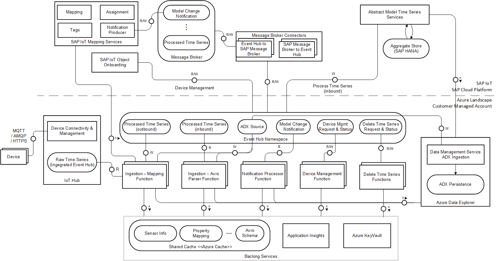

# Overview

Customer-managed Data Persistence and Streaming Abstraction enables SAP Line of Business (LoB) Applications like Digital Supply Chain (DSC) applications to consume time series data both via REST and streaming from SAP and non-SAP i.e., customer-managed Hyperscaler Data Lake with SAP-defined schema. 

This repository provides a reference template for enabling ingestion and persistence of time series data in Azure with integration to SAP IoT Abstract Model Services conforming to SAP defined schema for persistence and streaming data.

The project structure showing all functions in the Azure IoT Integration Reference setup is shown below:

```
└───azure-iot-integration-ref
    ├───arm-tempate
    ├───device-management-functions
        ├───DeviceManagementFunction
    ├───ingestion-functions
        ├───AvroParserFunction
        └───MappingFunction
    ├───integration-commons
    └───notification-processor
        └───NotificationProcessorFunction
```

## Data Ingestion Architecture 

The data ingestion pipeline is responsible for consuming messages from IoT Hub and persisting it into time series storage, and writing the ingested message into a message broker that can be consumed by downstream processor (Processed-time-series). The main aspects of data ingestion pipeline are as below

- Consume raw message from device in IoT Hub integrated Event Hub
- Apply the mapping function to convert from device message format to application model specific construct
- Accumulate (cache) mapping & device --> object assignment information 
- Store the mapped message into persistence. In certain cases, this can be achieved by writing into another Event Hub which is configured as the source for Persistence
- Write the mapped message into processed-timeseries Event Hub in avro format as defined by Avro Schema Lookup Services



### Data Ingestion Components

The Data Ingestion architecture block diagram shows the key components in Azure that is a part of the data ingestion and persistence. Here is an overview of those components:  

- **IoT Hub**: IoT Device connects and sends data to Azure IoT Hub which is then processed by Ingestion Functions.

- **Mapping Function**: Azure function that does mapping from device payload to Application model

- **Avro Parser Function**: Azure function that consumes the list of Processed Timeseries data messages in Avro format then Avro messages are deserialized to JSON format and then persisted into the respective ADX table provided

- **Notification Processor Function**: Azure function that processes the model change notifications that are generated when any changes are made to the equipment model in SAP IoT Applications

- **Device Management Function**: Azure function that allows managing of device in Azure IoT Hub

- **Azure Cache for Redis**: Used for caching mapping, assignment, Avro schema, etc., (all cache types mentioned in section below) 

- **Application Insights**: Used for logging, and will be used as error store to look at errors in ingestion 

- **Azure KeyVault**: Used to store credentials (like SAP IoT tenant client id and secret; other credentials used in mapping functions) 

- **EventHub Namespace**: Set of EventHub used in ingestion 

- **Azure Data Explorer**: Use of ADX Data Management Services (Ingestion) is recommended for ingesting data into ADX, instead of direct write into ADX engine


## Structure of documentation

The documentation is structured as follows in GitHub:

- Azure Resource Manager Template (ARM): This is a step by step guide on how to generate and deploy all the Azure resources required using the ARM Template.

- Message Broker: This document describes the message broker topics and message formats.

- Ingestion: This explains the Azure Functions needed for Ingestion from IoT Hub, Device Formats and Caching used. This function writes the messages to ADX Source EevntHub topic which is then ingeted to ADX using EventHub Connector for ADX.

- AvroParserFunction: This document explains the ADX Ingestion Function which processes the avro messages from Write Time Series API and ingests into ADX Source EventHub. These messages are consumed by EventHub Connector for ADX and ingested into ADX

- Device Management: This document describes the device function in the reference template that allows managing of device in Azure IoT Hub.

- Error Handling: This document describes the error handling in the functions present in the Azure IoT Integration Reference.

- Notification Processor: This document describes the processing of the model change notifications that are generated when any changes are made to the equipment model in SAP IoT Applications.

- Security: This document provides an overview of security-relevant information that applies this reference template. 